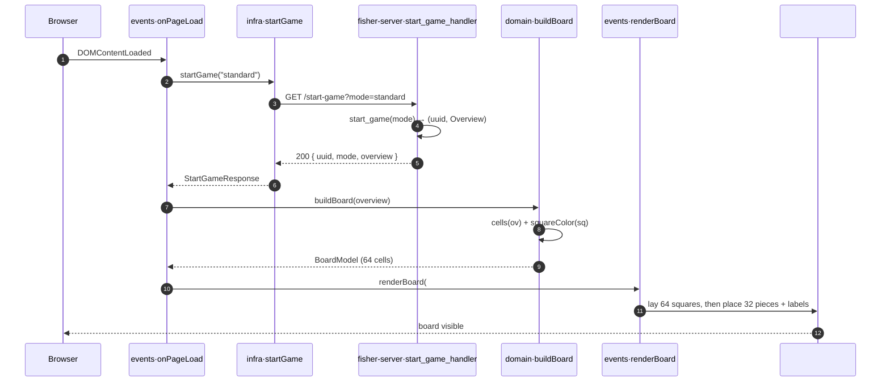

```yaml
id: START-A-GAME
stream-id: GAME-LIFECYCLE
type: feature
status: draft
language: TypeScript + Rust
related_entities:
  - GAME
  - OVERVIEW
  - PIECE
related_tests:
  - IT-F0001
  - UT-F0001
```

# Goal

Opening the app at **http://localhost:5173/** shows a chessboard with pieces on
it. The front end gets that board from the back end in one call: `GET
/start-game` on `fisher-server` returns the new game's `uuid` and its position as
an **`Overview`** object — the project's own JSON board model, not FEN. The
board is an 8×8 grid of DOM squares, stays square and responsive, and is edged
with file marks `a`–`h` and rank marks `1`–`8`. Two layouts are supported:
**standard** (every piece on its normal starting square) and **random** (a dev
layout that places a single **caller-chosen** count — 2 to 16, set on the web
page — on **each** colour, at random positions and from a **realistic army**:
one king, and the rest drawn within the standard per-type material caps). After
the call the user sees a fully rendered position that matches the returned
`Overview` exactly.
Every algorithm — generation, parsing, rendering — is based on the `Overview`
model.
Pieces will be SVG images taken from Lichess (plain full black & white pieces).

---

# Gap

Nothing exists yet. The back end is the Cargo hello-world with no Axum server and
no `/start-game` route. The front end is the Vite starter — it renders the Vite +
TypeScript landing page and a counter button, with no board, no `infra` call, and
no `domain` model. There is no `GAME` concept, no `Overview` type, and no contract
between the two modules. This feature defines the `Overview` representation, stands
the contract up, and renders the first board.

---

# Inputs

Two caller inputs, both on the query string: the layout **mode**, and — for
`random` only — a single **piece count** applied to both colours.

| Wire form (query)        | Internal mode | Meaning                                    |
| ------------------------ | ------------- | ------------------------------------------ |
| _(absent)_               | `standard`    | Default. Normal chess starting position.   |
| `?mode=standard`         | `standard`    | Explicit standard layout.                  |
| `?mode=random`           | `random`      | Dev layout: caller-set count, random positions. |
| `?mode=<anything else>`  | —             | Rejected (see [Errors](#errors)).          |

**Piece count — `random` mode only.** The number of pieces is **not** random: a
single count is chosen on the web page and passed through to the service. It
fixes **both** colours to that many pieces. Only the *positions* are random.

| Wire form (query)        | Internal          | Meaning                                              |
| ------------------------ | ----------------- | --------------------------------------------------- |
| `&pieces=<n>`            | `piece_count = n` | How many pieces to place **per colour** — white and black alike. Integer `2 ≤ n ≤ 16`. |
| _(omitted in `random`)_  | `16`              | Default count when the param is absent.             |
| _(present in `standard`)_| ignored           | The count applies to `random` only; ignored otherwise. |

The count **includes** that colour's mandatory king (rule **B-4**), so the
minimum of `2` is king + one other piece (e.g. `pieces=4` ⇒ 4 white and 4 black,
each including its king). Which pieces fill the count is constrained by the
per-colour material caps (rule **B-10**): the king plus a draw that never exceeds
1 queen, 2 rooks, 2 bishops, 2 knights, or 8 pawns. Those caps sum to `16`, so
`pieces=16` forces the full army and only the *positions* are random. The
`Overview` model is produced by the back end and consumed by the front end; it is
never sent by the caller.

Every time the player presses **rematch**, changes the **mode**, or changes the
**piece count** on the page, the front issues a fresh `GET /start-game` with the
current values.

---

# Output

`GET /start-game` returns `200 OK` with this JSON body:

```json
{
  "uuid": "550e8400-e29b-41d4-a716-446655440000",
  "mode": "standard",
  "overview": {
    "board": [
      ["r","n","b","q","k","b","n","r"],
      ["p","p","p","p","p","p","p","p"],
      ["","","","","","","",""],
      ["","","","","","","",""],
      ["","","","","","","",""],
      ["","","","","","","",""],
      ["P","P","P","P","P","P","P","P"],
      ["R","N","B","Q","K","B","N","R"]
    ],
    "white": "both",
    "black": "both"
  }
}
```

| Field      | Type                 | Notes                                            |
| ---------- | -------------------- | ------------------------------------------------ |
| `uuid`     | string (v4)          | Identifier of the freshly created game.          |
| `mode`     | `"standard"` \| `"random"` | Echoes the resolved layout mode.           |
| `overview` | `Overview`           | The board model — see below.                     |

The **`Overview`** model:

| Field   | Type                | Notes                                                       |
| ------- | ------------------- | ----------------------------------------------------------- |
| `board` | `string[8][8]`      | 8 rows × 8 columns. `board[0]` is rank 8, `board[7]` is rank 1; column `0` is file `a`, column `7` is file `h`. Each cell is `""` (empty) or one piece letter. |
| `white` | `Castle`            | White's castling availability.                              |
| `black` | `Castle`            | Black's castling availability.                              |

Piece letters: uppercase = white (`P N B R Q K`), lowercase = black
(`p n b r q k`). Empty cells are the empty string `""`.

`Castle` is one of: `"both"`, `"short castle"` (king-side only), `"long castle"`
(queen-side only), `"none"`.

---

# Flow & routines

The named routines below are the contract the tests pin. The front keeps the
role split from [coding-rules.md](../../global/coding-rules.md) §1: `events` owns
the DOM and orchestration, `infra` owns the network, `domain` is pure. The back
end keeps thin handlers that delegate to a business-named routine and log each
step with the game `uuid` ([coding-rules.md](../../global/coding-rules.md) §2;
ports and processes in [architecture.md](../../global/architecture.md) §6).

**Front — `chessgame/src/`**

| Routine | Folder · signature | Responsibility |
| --- | --- | --- |
| `onPageLoad` | `events` · `onPageLoad(): Promise<void>` | Entry point wired to `DOMContentLoaded`. Reads the page's mode + piece-count controls, then orchestrates the flow: `startGame` → `buildBoard` → `renderBoard`. The one routine that touches all three layers. |
| `startGame` | `infra` · `startGame(opts?: { mode?: Mode; pieces?: number }): Promise<StartGameResponse>` | The only network seam. Issues `GET /start-game` with the mode and (for `random`) the `pieces` count; parses `{ uuid, mode, overview }`. |
| `cells` | `domain` · `cells(ov: Overview): Cell[]` | Pure. Walks `overview.board`, returns the occupied `{ square, piece }` cells. |
| `squareColor` | `domain` · `squareColor(square: string): "light" \| "dark"` | Pure. `a1` dark; `(file+rank)` parity. |
| `buildBoard` | `domain` · `buildBoard(ov: Overview): BoardModel` | Pure. Assembles the 64-cell model (coord + colour + optional piece) from `cells` + `squareColor`. No DOM, no network. |
| `renderBoard` | `events` · `renderBoard(root: HTMLElement, model: BoardModel): void` | DOM writer. Lays the 64 squares first, then places pieces and edge labels. |

**Back — `fisher-server/src/`**

| Routine | Module · signature | Responsibility |
| --- | --- | --- |
| `start_game_handler` | `main` · `GET /start-game` | Thin Axum handler: validate `mode` and the `pieces` count, delegate, map to JSON. |
| `start_game` | `game` · `start_game(mode: Mode, pieces: u8) -> (Uuid, Overview)` | Business delegate: create the `GAME`, register it, build its `Overview`. |
| `standard_overview` | `game::overview` · `standard_overview() -> Overview` | Build the standard layout (rule **B-2**). |
| `random_overview` | `game::overview` · `random_overview(pieces: u8) -> Overview` | Place exactly `pieces` of each colour at random positions, drawn from a realistic army within the per-type caps (rules **B-3**–**B-8**, **B-10**, **B-11**). |

**Walkthrough — how the board is created**

The board is built in two places: `fisher-server` *generates the position* as an
`Overview`; the front *turns it into a visible 8×8 DOM grid*. No board exists
until the page loads and calls the API once.

1. **Page load triggers it.** `events.onPageLoad` is wired to `DOMContentLoaded`
   — the one routine that spans all three layers. It reads the page's mode and
   piece-count controls.
2. **Ask the server.** `onPageLoad` calls `infra.startGame({ mode, pieces })`,
   the single network seam, which issues `GET /start-game` with those values
   (rule **F-8**).
3. **The server builds the position — data, not UI.** `start_game_handler`
   validates `mode` and `pieces`, then delegates to `game::start_game`, which
   creates the `GAME` with a fresh `uuid` (rule **B-1**) and builds the
   `Overview` via `standard_overview` or `random_overview(pieces)` — placing
   *exactly* `pieces` of each colour at *random* positions, drawn from a realistic
   army within the per-type caps (rules **B-2**–**B-8**, **B-10**, **B-11**).
   It returns `200 { uuid, mode, overview }`.
4. **Build the board model — pure, no DOM yet.** Back on the front, `onPageLoad`
   passes `overview` to `domain.buildBoard`, which uses `cells` (occupied
   squares, rule **F-3**) and `squareColor` (light/dark, rule **F-2**) to
   assemble a 64-cell `BoardModel`.
5. **Create the DOM board.** `onPageLoad` calls `events.renderBoard(#board,
   model)`: it lays the 64 square elements **first**, then nests each piece
   (an SVG image) inside its square and draws the edge labels (rules **F-1**,
   **F-4**, **F-5**, **F-6**).
6. **Board is visible.** The responsive 8×8 grid (rule **F-7**) shows the
   position the server sent. If `startGame` rejects, `renderBoard` is skipped —
   no half-built board (see [Errors](#errors)).

**Sequence — page load to rendered board**



The unit tests ([UT-F0001](unit_test_F0001.md)) target `cells`, `squareColor`,
`buildBoard`, `renderBoard`, and `startGame` directly; the integration tests
([IT-F0001](IT-F0001.md)) drive `start_game_handler` over HTTP.

---

# Rules

Rules split into the back-end contract (`B-*`) and the front-end render (`F-*`).
Everything not listed here is **out of scope** (see below): no moves, no engine,
no turn handling.

1. **B-1 — One game per call.** Each `GET /start-game` creates a new `GAME` with
   a fresh v4 `uuid` and stores it in the in-memory game registry keyed by
   `uuid`. Two calls return two different `uuid`s.

2. **B-2 — Standard layout.** For `mode=standard` (the default), `overview.board`
   equals exactly:

   ```
   row 0 (rank 8): r n b q k b n r
   row 1 (rank 7): p p p p p p p p
   rows 2–5      : all "" (empty)
   row 6 (rank 2): P P P P P P P P
   row 7 (rank 1): R N B Q K B N R
   ```

   and `overview.white == "both"`, `overview.black == "both"`.

3. **B-3 — Caller sets the count; only positions are random.** For
   `mode=random`, a single piece count comes from the request (`pieces`), **not**
   from the server. It fixes **both** colours: the server places *exactly*
   `pieces` white pieces and `pieces` black pieces, randomising only **where**
   they go — never **how many**. `pieces` is an integer `2 ≤ n ≤ 16`, defaulting
   to `16` when absent. In the returned `overview.board`, the non-empty white
   cells and the non-empty black cells **each** number exactly `pieces`.

4. **B-4 — Random always has exactly one king per colour.** Every random layout
   contains exactly one `"K"` cell and exactly one `"k"` cell. The king is
   counted within that colour's `pieces` from rule **B-3** (so `pieces = 2` means
   each side has its king plus one other piece).

5. **B-5 — One piece per cell.** Every `board` cell is either `""` or a single
   valid piece letter; by construction no cell holds two pieces. (This replaces
   FEN's "distinct squares" guarantee — the 2D array enforces it.)

6. **B-6 — Random pawns stay off the back ranks.** No `"P"` appears in `board[0]`
   (rank 8) and no `"p"` appears in `board[7]` (rank 1), so the position stays
   renderable and broadly legal. Non-pawn pieces may sit anywhere.

7. **B-7 — Random has no castling rights.** A random layout sets
   `overview.white == "none"` and `overview.black == "none"` (scattered pieces
   make castling meaningless). This replaces FEN's fixed-tail rule.

8. **B-8 — Well-formed `Overview`.** `board` is always exactly 8 rows of 8
   columns; every cell is `""` or one of `{p,n,b,r,q,k,P,N,B,R,Q,K}`; `white`
   and `black` are each one of the `Castle` values. This holds for both modes.

9. **B-9 — CORS.** The route answers cross-origin requests from
   `http://localhost:5173` (the front dev origin), per
   [architecture.md](../../global/architecture.md) §6.

10. **B-10 — Random army respects per-colour material caps.** In `mode=random`,
    the `pieces` placed for each colour are a realistic army: the mandatory king
    (rule **B-4**) plus a draw that never exceeds the standard maximum material
    for any piece type. Per colour:

    | Piece (per colour) | Cap | Note |
    | ------------------ | --- | ---- |
    | `K` / `k` (king)   | exactly 1 | mandatory — rule **B-4** |
    | `Q` / `q` (queen)  | ≤ 1 |  |
    | `R` / `r` (rook)   | ≤ 2 |  |
    | `B` / `b` (bishop) | ≤ 2 | the pair sits on opposite square colours — rule **B-11** |
    | `N` / `n` (knight) | ≤ 2 |  |
    | `P` / `p` (pawn)   | ≤ 8 | off the back ranks — rule **B-6** |

    The caps sum to `16`, matching the `pieces` upper bound, so `pieces=16` forces
    exactly the full army (`1 Q, 2 R, 2 B, 2 N, 8 P` + king) for each colour and
    only the *positions* vary; a lower `pieces` drops pieces from that army while
    always keeping the one king. Both colours satisfy the caps independently. This
    holds only for `random`; `standard` is fixed by rule **B-2**.

11. **B-11 — A bishop pair sits on opposite square colours.** When a colour is
    given 2 bishops, one stands on a light square and the other on a dark square,
    by the standard board parity (`a1` is dark; rule **F-2**). A colour with 0 or
    1 bishop carries no such constraint. Apart from this and rule **B-6**, any
    non-pawn piece may sit on any square.

12. **F-1 — 64 squares.** `renderBoard` builds an 8×8 grid of square elements.
    Each square carries its algebraic coordinate (e.g. `data-square="a1"`),
    file `a`→`h` left to right, rank `8` (top) → `1` (bottom): white is at the
    bottom.

13. **F-2 — Square colour.** `squareColor(square)` returns `dark` for `a1`. A
    square is **dark** when `(file_index + rank_index)` is even and **light**
    when odd, using `a`=1…`h`=8 and rank `1`=1…`8`=8.

14. **F-3 — `Overview.board` drives the pieces.** `cells(overview)` reads
    `overview.board`: `board[r][c]` maps to file `c` (`a`+c), rank `8−r`.
    Row 0 is the top (rank 8), column 0 is the left (file `a`). A `""` cell is an
    empty square; any other cell is an occupied `{ square, piece }`. `buildBoard`
    folds those into the model, and `renderBoard` places each piece marked with
    its letter (e.g. `data-piece="N"` for a white knight) **inside that square's
    element**. Uppercase = white, lowercase = black.

15. **F-4 — Grid first, then pieces; grid reused on re-render.** `renderBoard`
    lays all **64 square elements first**, then attaches each piece to its
    existing square, so every piece element is nested inside its square
    (`[data-square] > [data-piece]`) and no piece is ever attached to an empty
    container. When piece placement starts the board grid is already fully built.
    On a **re-render** (rematch, or a `mode`/`pieces` change), `renderBoard`
    reuses the existing 64-square grid and replaces only the pieces — it never
    rebuilds or duplicates the grid (the square count stays 64).

16. **F-5 — Exact match.** The set of occupied squares and the piece on each one
    matches `overview.board` with no extra or missing pieces. An all-`""` row
    renders eight empty squares.

17. **F-6 — Edge labels.** File marks `a`–`h` run along the bottom edge and rank
    marks `1`–`8` run along the left edge, aligned to their files/ranks.

18. **F-7 — Responsive & square.** The board keeps a 1:1 aspect ratio and scales
    with its container/viewport; it never distorts. Labels and squares scale
    together.

19. **F-8 — Single network seam.** Only `infra.startGame` calls `GET
    /start-game` and parses the `{ uuid, mode, overview }` response; `domain`
    (`cells`/`squareColor`/`buildBoard`) works purely on the `Overview` model
    (no DOM, no network); `events.onPageLoad` orchestrates and `events.renderBoard`
    writes the DOM. This mirrors
    [coding-rules.md](../../global/coding-rules.md) §1.

**Unchanged / not introduced:** no FEN anywhere in the app contract, no `POST`
game creation, no move endpoints, no Stockfish/UCI contact, no persistence beyond
the in-memory registry, no captured-piece or move-list panels. (Stockfish still
speaks UCI/FEN internally — that is the engine's concern, out of scope here.)

---

# Errors

| Condition                         | Stage that rejects        | Outcome                                  |
| --------------------------------- | ------------------------- | ---------------------------------------- |
| `mode` is not `standard`/`random` | handler input validation  | `400 Bad Request`, JSON `{ "error": "invalid mode" }` |
| `pieces` not an integer in `2..=16` (`random`) | handler input validation | `400 Bad Request`, JSON `{ "error": "invalid piece count" }` |
| `Overview` generation fails (random) | layout routine         | `500 Internal Server Error` (should not occur: the caps sum to `16`, so any in-range `pieces` is satisfiable under **B-3**–**B-8**, **B-10**, **B-11**) |
| Back end unreachable / non-2xx    | front `infra`             | Render is skipped; `infra` surfaces the error to the caller (no partial board) |

The success path returns `200`. No other status is defined by this feature.
`404`/`409`/`5xx-engine` contracts from
[coding-rules.md](../../global/coding-rules.md) §2.2 belong to later features and
are unchanged here.

---

# Examples

Input is the query (`mode` and, for `random`, the `pieces` count); output is the
`Overview` (and the board it renders).

| Query                       | `overview` (example)                                                | Rendered board                                              |
| --------------------------- | ------------------------------------------------------------------ | ---------------------------------------------------------- |
| _(absent)_                  | standard `board` (see [Output](#output)), `white/black = "both"`   | 32 pieces on ranks 1–2 (white) and 7–8 (black); 32 empty.  |
| `?mode=standard`            | same as above                                                      | Same as above.                                             |
| `?mode=random&pieces=4`     | `board` with `K` e1, `Q` d1, `N` c5, `P` e2 (white), `k` e8, `p` d7, `n` b6, `q` f4 (black); `white/black = "none"` | exactly 4 white + 4 black, one king each, within the caps, random squares. |
| `?mode=random&pieces=16`    | each colour holds exactly `1 K, 1 Q, 2 R, 2 B, 2 N, 8 P`; `white/black = "none"` | the full army, scattered — caps sum to 16, so composition is fixed and only positions vary (rule **B-10**); each colour's 2 bishops land on opposite-coloured squares (rule **B-11**). |
| `?mode=random&pieces=1`     | —                                                                  | n/a — rejected: `400 invalid piece count` (below 2; see [Errors](#errors)). |
| `?mode=random&pieces=20`    | —                                                                  | n/a — rejected: `400 invalid piece count` (above 16).      |
| `?mode=xyz`                 | —                                                                  | n/a — rejected: `400 invalid mode` (see [Errors](#errors)). |

The `pieces=4` row's `board` in full:

```json
"board": [
  ["","","","","k","","",""],
  ["","","","p","","","",""],
  ["","n","","","","","",""],
  ["","","N","","","","",""],
  ["","","","","","q","",""],
  ["","","","","","","",""],
  ["","","","","P","","",""],
  ["","","","Q","K","","",""]
]
```

The `pieces=4` row is one *illustrative* draw; the positions vary per call, but
the per-colour count stays fixed at `pieces`, and every draw is a realistic army
within the caps, under rules **B-3**–**B-8**, **B-10**, and **B-11**.

---

# Implementation surface (informative)

The routines and their files are listed in [Flow & routines](#flow--routines).
This section adds only the **non-routine deltas** — build setup, wiring, and what
stays untouched.

| Path                  | Delta (beyond the routines above)                                   |
| --------------------- | ------------------------------------------------------------------- |
| `fisher-server/Cargo.toml` | Add `axum`, `tokio`, `serde`, `uuid`, `tower-http` (CORS), a logger. |
| `fisher-server/src/main.rs` | Boot Axum on `:7200`, mount `start_game_handler`, enable CORS, init logging. |
| `chessgame/src/main.ts`   | Replace the Vite starter page; wire `onPageLoad` to `DOMContentLoaded`. |
| `chessgame/src/style.css` | Responsive square board, light/dark squares, edge labels, SVG pieces. |

**Not touched:** Stockfish/engine code, any move or turn logic, persistence.

---

# Out of scope

Deferred deliberately; each lands in a later feature:

- **Making moves** (select/drag/drop, `POST` a move) — needs the move contract.
- **Engine replies** — `fisher-server` ↔ Stockfish over UCI (FEN at that
  boundary only); no engine call here.
- **Turn/state panels** — move list, captured pieces, whose-turn indicator.
- **Move-legality of random layouts** — random is a dev render aid, not a legal
  game; only the **B-4**/**B-6**/**B-10**/**B-11** sanity constraints apply (one
  king, pawns off the back ranks, realistic material caps, bishop pair split by
  square colour). No check/checkmate, turn, or reachability validation.
- **Castling moves** — `Overview` *records* castling availability; performing a
  castle is a later move feature.
- **Persistence** — the in-memory registry is enough for the demo; survives no
  restart.
- **Board flip / play-as-black orientation** — white-at-bottom only for now.
