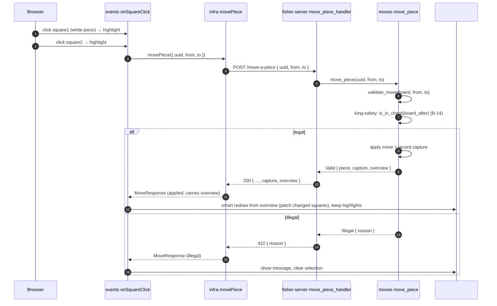
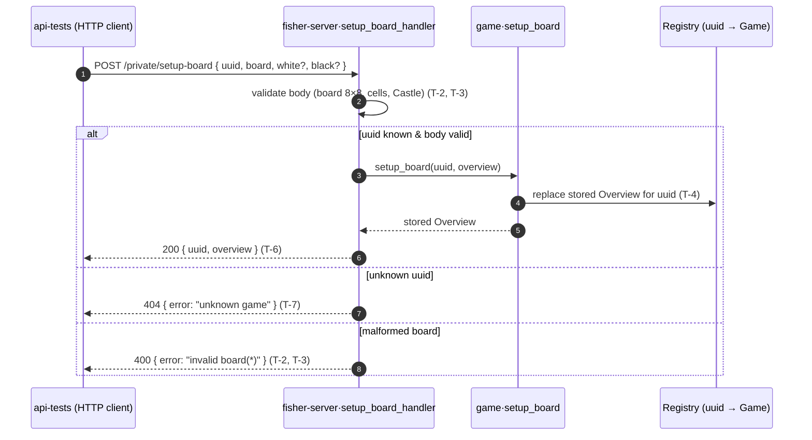

```yaml
id: MOVE-A-PIECE
stream-id: GAME-PLAY
type: feature
status: draft
language: TypeScript + Rust
related_entities:
  - GAME
  - MOVE
  - PIECE
  - OVERVIEW
related_tests:
  - IT-F0002
  - UT-F0002
```

# Goal

On a board already served by [F0001](../F0001-start-a-game/F0001.md), the player
(always **White** for now) moves one piece by clicking two squares. The first
click picks the **source** (`square1`, e.g. `d2`); the second picks the
**target** (`square2`, e.g. `d4`) and immediately fires `POST /move-a-piece` on
`fisher-server` with the game `uuid` and the pair `from`/`to`. The server is the
sole authority. It re-checks the move against the position it holds for that
`uuid` — source carries a white piece, shape fits the piece type, path is clear,
and the move must not leave White's king in check — and answers `"valid"` or
`"illegal"`. On a valid move it updates the game's
stored `Overview`, records any captured black piece, and echoes the outcome —
including the **complete board after the move**. Because that board is
authoritative, the front simply **redraws from it** rather than hand-moving
pieces: a smart redraw that patches only the squares whose content changed and
leaves both squares highlighted. An illegal move shows a message and clears the
selection. When the next move begins, picking a new source first resets the
previous move's highlights, so only the current selection is ever coloured.

---

# Gap

F0001 renders a static position and stops there — nothing moves. The front's
[`onPageLoad`](../../../chessgame/src/events/onPageLoad.ts) fetches the board,
builds the model, renders it, and **discards** `resp.uuid`; there is no click
handler, no selection state, and no `infra` routine that talks to a move
endpoint. F0001 listed *"Making moves (select/drag/drop, `POST` a move)"* as
explicitly out of scope.

The back end has no move route. [`app()`](../../../fisher-server/src/lib.rs)
mounts only `GET /start-game`; there is no `moves` module, no move validator, and
the [`Game`](../../../fisher-server/src/game/mod.rs) struct holds `{ uuid, mode,
overview }` with **no place to record captured pieces**. The proof-log stream set
[`LogFeature`](../../../fisher-server/src/proof_log.rs) has one variant,
`StartAGame`. This feature adds the move contract end to end: click-driven
selection on the front, the `POST /move-a-piece` route, an authoritative move
validator, and the state updates (moved piece + captured list) on the server.

---

# Inputs

One caller input: a move, sent as a JSON body on `POST /move-a-piece`. Squares are
lowercase algebraic coordinates in `a1..h8` (the same form F0001 writes into
`data-square`).

| Field  | Wire form            | Meaning                                             |
| ------ | -------------------- | --------------------------------------------------- |
| `uuid` | string (v4)          | The game to move in — must be a game F0001 created.  |
| `from` | string `a1..h8`      | Source square (`square1`). Must hold a white piece.  |
| `to`   | string `a1..h8`      | Target square (`square2`). Must differ from `from`.  |

The front derives all three: `uuid` is what F0001's `GET /start-game` returned
(now retained, rule **F-8**), and `from`/`to` are the two squares the player
clicked (rules **F-1**, **F-4**). The player never types a move. The board
position is **not** sent — the server already holds it for the `uuid` and is the
single source of truth ([coding-rules.md](../../global/coding-rules.md) §4).

---

# Output

`POST /move-a-piece` carries the verdict in the **HTTP status**: `200 OK` when the
move is applied, `422 Unprocessable Content` when the move is illegal (a
well-formed request the chess rules reject). Malformed requests are `400` and an
unknown game is `404` (see [Errors](#errors)).

**Valid move** — `200 OK`:

```json
{
  "from": "d2",
  "to": "d4",
  "piece": "P",
  "capture": null,
  "overview": {
    "board": [ "… the updated 8×8 board …" ],
    "white": "both",
    "black": "both"
  }
}
```

**Illegal move** — `422 Unprocessable Content`:

```json
{ "reason": "path blocked" }
```

| Field      | Type                | Notes                                                       |
| ---------- | ------------------- | ----------------------------------------------------------- |
| `from`     | string `a1..h8`     | Echoes the source square (`200` only).                      |
| `to`       | string `a1..h8`     | Echoes the target square (`200` only).                      |
| `piece`    | string (one letter) | The moved piece, uppercase = white (`200` only).            |
| `capture`  | string \| `null`    | The captured black piece letter, or `null` when not a take (`200` only). Informational — the front does not need it to render (rule **F-5**); `overview` already reflects the take. |
| `overview` | `Overview`          | The game's board **after** the move — the F0001 model, authoritative (`200` only). The front redraws straight from this (rule **F-5**). |
| `reason`   | `IllegalReason`     | Why the move was refused (`422` body only) — closed set below. |

`IllegalReason` is one of: `"not your piece"`, `"own piece on target"`,
`"illegal shape"`, `"path blocked"`, `"king in check"` (see [Rules](#rules) /
[Errors](#errors)).

The `Overview` shape is unchanged from
[F0001 → Output](../F0001-start-a-game/F0001.md#output). The running list of
captured pieces stays **server-side** on the game (rule **B-7**) and is not
returned here — a captured-pieces panel is a later feature (see
[Out of scope](#out-of-scope)).

---

# Accessible squares

Move legality is **reachability**: `from → to` is legal exactly when `to` is a
square the piece on `from` can reach on the current board. One pure routine
enumerates that set — `accessible_squares(board, from)` — and every check in
[Rules](#rules) (**B-2**–**B-6**) is its constructive form. This feature also runs
the same enumeration over the opponent's pieces to see whether a king is in check
(rules **B-14**/**B-15**).

**What an accessible square is.** Each entry pairs an on-board position with what
sits on it — the two shapes the request named, `(position, empty)` and
`(position, <enemy piece>)`:

```
AccessibleSquare = { square: "a1".."h8", target: Empty | Capture(piece) }
```

- `Empty` — the destination is vacant; a quiet move.
- `Capture(piece)` — the destination holds an **enemy** piece that would be taken
  (the request's *hanging piece*). `piece` is that letter, echoed as `capture`
  (rules **B-6**, **B-8**).

A square is **excluded** — never accessible — when it falls off the board
(outside `a1..h8`) or holds a **friendly** piece (rule **B-3**).

**The routine.** `accessible_squares(board, from) -> Vec<AccessibleSquare>` reads
the piece on `from` and returns every square it may legally move to, each tagged
`Empty` or `Capture`. It applies the geometry the rules already define — shape
(**B-4**), clear path (**B-5**), pawn push/capture (**B-12**) — and tags occupancy
(**B-6**). It does **not** itself consider check. It runs for **both** colours:
the mover (White) to enumerate legal moves, and Black pieces during check
detection (**B-15**). A pawn's forward direction follows its colour — White toward
rank 8, Black toward rank 1.

**How each piece generates its squares** (rule **B-12**):

| Piece | Candidates | Blocking & occupancy |
| ----- | ---------- | -------------------- |
| King (`K`)   | the 8 one-step neighbours | keep on-board; `Empty` if vacant, `Capture` if enemy, drop if friendly |
| Knight (`N`) | the 8 `L` targets | same as king — it jumps, no path check |
| Rook (`R`)   | walk the 4 rank/file **rays** | add `Empty` squares outward until the first piece; an **enemy** there is a `Capture` that ends the ray, a **friendly** ends the ray and is dropped |
| Bishop (`B`) | the 4 diagonal rays | same ray rule as the rook |
| Queen (`Q`)  | all 8 rays | same ray rule |
| Pawn (`P`)   | forward push(es) + the 2 forward diagonals | a push square must be `Empty` (one step; two from the base rank, both empty); a diagonal counts **only** as a `Capture` of an enemy, never `Empty` |

For a slider (`Q`/`R`/`B`) the ray **stops at the first occupied square** — the
constructive form of "path is clear" (**B-5**) plus "take the enemy, not your
own" (**B-3**/**B-6**).

**Pseudo-legality is membership** (rule **B-13**). The *pseudo-legal* targets of
`from` are exactly `accessible_squares(board, from)`, so `validate_move` accepts a
target when some entry has `square == to`, taking the `capture` from its `target`
(`Empty → null`, `Capture(p) → p`). Full legality then adds the king-safety gate
(**B-14**). On the illegal branch `validate_move` reports the precise
`IllegalReason` (**B-2**–**B-5**, **B-14**).

**Why this shape.** With reachability as a routine, "is White's king in check?"
becomes "is the king's square the `target` of any black piece's accessible
squares?" — a union over the other colour. `is_in_check` asks exactly this after a
move is simulated (rules **B-14**/**B-15**). Because the king's square is
*occupied*, `accessible_squares` handles pawns with no separate attack set: a
black pawn's diagonal onto the king is a `Capture` target (a real check), while
its forward push needs an empty square, so it never checks straight ahead. A
general attack-set over *empty* squares (for castling-through-check) stays
[out of scope](#out-of-scope).

---

# Flow & routines

The routines below are the contract the tests pin. The front keeps the role
split from [coding-rules.md](../../global/coding-rules.md) §1: `events` owns the
DOM, selection state, and orchestration; `infra` owns the network; `domain` is
pure. The back end keeps a thin handler that validates the request and delegates
to a business-named `moves` routine, logging each step with the game `uuid`
([coding-rules.md](../../global/coding-rules.md) §2; proof-log placement in
[proof-logs.md](../../global/proof-logs.md)).

**Front — `chessgame/src/`**

| Routine | Folder · signature | Responsibility |
| --- | --- | --- |
| `onPageLoad` | `events` · `onPageLoad(): Promise<void>` | Extended from F0001: after render, **retain** `resp.uuid` and wire click handling on `#board` (rule **F-8**). |
| `onSquareClick` | `events` · `onSquareClick(square: string): void` | The selection state machine. First click resets any previous move's highlights (rule **F-9**) then sets `square1` (front checks, rules **F-1**/**F-2**); clicking `square1` again deselects (rule **F-3**); a second click sets `square2` and drives the move (rule **F-4**). |
| `movePiece` | `infra` · `movePiece(req: { uuid: string; from: string; to: string }): Promise<MoveResponse>` | The only network seam for moves (rule **F-7**). Issues `POST /move-a-piece`; resolves `200`→the applied outcome and `422`→`{ reason }` (illegal), and throws on any other status (rule **F-7**). |
| `isWhitePiece` | `domain` · `isWhitePiece(letter: string): boolean` | Pure. `true` when `letter` is a non-empty uppercase piece letter. Backs the `square1` front check. |
| `applyValidMove` | `events` · `applyValidMove(overview: Overview): void` | DOM writer. **Smart redraw**: rebuild the pure model with `domain.buildBoard(overview)`, then patch **only** the squares whose piece differs from what is rendered (source emptied, target filled, any captured piece gone all fall out of the diff). Keeps both squares highlighted (rule **F-5**). |
| `rejectMove` | `events` · `rejectMove(message: string): void` | DOM writer. Shows the message and clears the selection + highlights (rule **F-6**). |

**Back — `fisher-server/src/`**

| Routine | Module · signature | Responsibility |
| --- | --- | --- |
| `move_piece_handler` | `lib` · `POST /move-a-piece` | Thin Axum handler: validate the body (`uuid`, `from`, `to` well-formed, `from != to`), look up the game, delegate, map the outcome to the HTTP status + body — `200`/`422` (rules **B-1**, **B-8**). |
| `move_piece` | `moves` · `move_piece(registry, uuid, from, to, session, tracking) -> MoveOutcome` | Business delegate: load the game's `Overview`, validate, and on success apply the move + record any capture, then return the outcome. |
| `validate_move` | `moves` · `validate_move(board, from, to) -> Result<Option<Capture>, IllegalReason>` | Pure legality check: source is white (**B-2**), target is not white (**B-3**), shape fits the piece (**B-4**), path is clear (**B-5**), pawn rules (**B-12**), then rejects a move that would leave White's king in check (**B-14**) via `is_in_check` on the post-move board. Returns the captured black piece (if any, **B-6**) or the `IllegalReason`. Its pseudo-legal set equals `accessible_squares` (rule **B-13**). |
| `accessible_squares` | `moves` · `accessible_squares(board, from) -> Vec<AccessibleSquare>` | Pure. Every square the piece on `from` may legally reach, each tagged `Empty` or `Capture` (see [Accessible squares](#accessible-squares)). Built from `legal_shape` + `path_clear`; runs for either colour, so check detection reuses it. |
| `is_in_check` | `moves` · `is_in_check(board, white) -> bool` | Pure. `true` when the `white` side's king is the `target` of any opposing piece's `accessible_squares` on `board` (rule **B-15**). Backs the king-safety gate. |
| `board_after` | `moves` · `board_after(board, from, to) -> Vec<Vec<String>>` | Pure. The board with the move applied (piece moved, any capture removed) — the position `is_in_check` tests (**B-14**) and the apply step writes (**B-7**). |
| `legal_shape` | `moves` · `legal_shape(piece, from, to, board) -> bool` | Pure per-piece geometry (rule **B-4**, and the pawn cases of **B-12**). |
| `path_clear` | `moves` · `path_clear(board, from, to) -> bool` | Pure. Every square strictly between `from` and `to` is empty (rule **B-5**); trivially `true` for knight/king. |

**Walkthrough — one white move, click to applied**

1. **Two clicks pick the move.** `events.onSquareClick` holds `square1`. The
   first click on a white piece resets any highlights a previous move left behind
   (rule **F-9**), then sets `square1` and highlights it (rules **F-1**,
   **F-2**); clicking it again clears it (rule **F-3**). A second, different
   click sets `square2` (rule **F-4**).
2. **Fire the move.** As soon as `square2` is set, `onSquareClick` calls
   `infra.movePiece({ uuid, from: square1, to: square2 })` — the single network
   seam (rule **F-7**) — issuing `POST /move-a-piece`.
3. **The server validates against its own position.** `move_piece_handler`
   checks the body and looks up the game (rule **B-1**); it delegates to
   `moves::move_piece`, which runs `validate_move` over the game's stored `board`
   (rules **B-2**–**B-6**), then rejects the move if it would leave White's king
   in check (rules **B-14**, **B-15**).
4. **Apply or refuse — data, not UI.** On a legal move the server clears `from`,
   writes the piece onto `to`, appends any captured black piece to the game's
   taken list (rule **B-7**), and returns `200 { …, capture, overview }`. On an
   illegal move it changes nothing and returns `422 { reason }` (rule **B-8**).
5. **The front reflects the verdict.** On `200`, `events.applyValidMove` takes
   the returned `overview` and **redraws the board from it**, patching only the
   squares whose content changed (source now empty, target now the moved piece,
   any captured piece gone), and leaves both squares highlighted (rule **F-5**).
   On `422`, `events.rejectMove` shows a message and clears the selection (rule
   **F-6**).

**Sequence — click to applied move**



The unit tests ([UT-F0002](unit_test_F0002.md)) target `isWhitePiece` and the
selection/DOM routines; the integration tests ([IT-F0002](IT-F0002.md)) drive
`move_piece_handler` over HTTP.

---

# Rules

Rules split into the back-end contract (`B-*`) and the front-end interaction
(`F-*`). This feature covers a **single white move**; everything not listed here
is [out of scope](#out-of-scope) — no black reply, no engine, no turn handling,
no checkmate/stalemate detection.

**Back end**

1. **B-1 — Endpoint & request contract.** `POST /move-a-piece` accepts a JSON
   body `{ uuid, from, to }`. The handler validates that `uuid` names a known
   game, that `from` and `to` are each a square in `a1..h8`, and that
   `from != to`. A malformed body is `400`; an unknown `uuid` is `404` (see
   [Errors](#errors)). Only then does it delegate to `moves::move_piece`.

2. **B-2 — Source must carry a white piece.** The piece on `from` (in the game's
   stored `board`) must be a non-empty **uppercase** letter. An empty `from` or a
   **lowercase** (black) piece makes the move illegal (`422`), `reason="not your
   piece"`. The player is White (fixed for now).

3. **B-3 — Target must not hold a white piece.** If `to` holds an uppercase
   (white) piece, the move is illegal (`422`), `reason="own piece on target"` —
   you cannot capture your own piece.

4. **B-4 — Shape must fit the piece type.** The move must be one the piece on
   `from` can make. Its per-piece shapes — one-step king, `L`-knight, sliding
   rays for queen, rook, and bishop, pawn pushes and diagonals — are the shapes
   `accessible_squares` enumerates ([Accessible squares](#accessible-squares),
   rule **B-12**), so they are not repeated here. `legal_shape` tests that shape
   **ignoring blockers**: a target that fits no shape for the piece is
   `reason="illegal shape"`; a right-shape move stopped by a piece in the path is
   `path blocked` instead (rule **B-5**).

5. **B-5 — Path must be clear for sliding pieces.** For queen, rook, and bishop,
   every square strictly between `from` and `to` (along the rank, file, or
   diagonal) must be empty, else `reason="path blocked"`. Knight jumps and king
   moves one square, so the check is trivially satisfied for them; the pawn
   double-step requires the single crossed square to be empty (rule **B-12**).

6. **B-6 — Capture detection.** When a legal move lands on a square holding a
   **black** (lowercase) piece, it is a **take**: that piece is the `capture`
   returned to the front (rule **B-8**) and is removed from the board by the
   apply step (rule **B-7**). A move onto an empty square has `capture = null`.

7. **B-7 — Apply the move & record the take (valid only).** On a legal move the
   server updates the game's stored `Overview` in the registry keyed by `uuid`:
   `board[from]` becomes `""` and `board[to]` becomes the moving piece; a captured
   piece is **appended to the game's taken-pieces list**. An illegal move leaves
   the game state **unchanged**. Castling-availability fields (`overview.white`,
   `overview.black`) are carried **unchanged** — recomputing rights is out of
   scope.

8. **B-8 — Response contract.** The **HTTP status is the verdict**. A legal move
   returns `200 { from, to, piece, capture, overview }` with the updated
   `overview`; an illegal move returns `422 { reason }` and no `overview`. The
   `422` (Unprocessable Content) marks a well-formed request the chess rules
   reject — distinct from a malformed request (`400`) or an unknown game (`404`),
   see [Errors](#errors). There is no `result` field: the status carries it.

9. **B-9 — White only, no reply.** Only White moves in this feature. The server
    does **not** flip turn, generate a black move, or call Stockfish; there is no
    turn ownership check yet. This assumption is revisited when the engine reply
    lands (see [Out of scope](#out-of-scope)).

10. **B-10 — CORS.** The route answers cross-origin requests from the front dev
    origin `http://localhost:5173`, now allowing the `POST` method, per
    [architecture.md](../../global/architecture.md) §6. This extends the F0001
    CORS layer to cover the new route and method.

11. **B-11 — Accessible-squares model.** `accessible_squares(board, from)`
    returns every square the piece on `from` may legally move to, each an
    `AccessibleSquare { square, target }` whose `target` is `Empty` (vacant) or
    `Capture(piece)` (an enemy piece taken, rule **B-6**). Off-board squares and
    friendly-occupied squares are excluded (rule **B-3**). See
    [Accessible squares](#accessible-squares).

12. **B-12 — Enumeration & blocking.** Candidates follow each piece's move shape:
    king and knight are single steps (the knight jumps); queen, rook,
    and bishop walk rays that **stop at the first occupied square** — an enemy
    there is a `Capture` that ends the ray, a friendly ends it and is dropped
    (the constructive form of **B-5**). A pawn moves **forward only**: a push
    onto an `Empty` square (two from its base rank, both empty), and a diagonal
    only as a `Capture` of an enemy — never backward, sideways, a straight
    capture, or a diagonal onto an empty square. Forward is toward the far rank
    for the piece's colour (White up, Black down), so the routine serves both
    sides for check detection (**B-15**).

13. **B-13 — Pseudo-legality is membership.** A move `from → to` is
    *pseudo-legal* exactly when some entry of `accessible_squares(board, from)`
    has `square == to`; that entry's `target` gives the `capture` (`Empty →
    null`, `Capture(p) → p`). Full legality adds the king-safety gate (**B-14**).
    `validate_move` yields the verdict and, when illegal, the precise
    `IllegalReason` (**B-2**–**B-5**, **B-14**). The enumeration and the
    per-check verdict define the **same** pseudo-legal set — one source of truth;
    no earlier rule is replaced.

14. **B-14 — King safety: a move must not leave White's king in check.** After a
    move is pseudo-legal (**B-2**–**B-6**, **B-13**), the server tests the
    position it would produce: it applies the move to a copy of the board via
    `board_after` (piece moved, any capture removed) and asks whether White's king
    is then in check (**B-15**). If it is, the move is **illegal**,
    `reason="king in check"`, and nothing is applied — the apply step (**B-7**) is
    skipped and the stored game is unchanged. This is the final legality gate: a
    move is fully legal only when it is both pseudo-legal and king-safe, so a move
    that fails to escape an existing check is rejected too.

15. **B-15 — Check detection via accessible squares.** White's king is in check on
    a board when its square (the `K` cell) is the `target` of **any** black
    piece's `accessible_squares` on that board. `is_in_check(board, white)`
    locates that side's king and returns `true` when some opposing piece reaches
    it. It reuses the enumeration (**B-11**/**B-12**), now run for Black too:
    since the king's square is *occupied*, a black pawn checks along its diagonals
    (a `Capture` target) but never straight ahead (its push needs an empty
    square). Only White's king is tested in this feature.

**Front end**

16. **F-1 — First click selects a white source.** With no `square1` held, a click
    on a square carrying a white piece first resets any highlights left from a
    previous move (rule **F-9**), then sets `square1` and highlights it. The front
    reads the piece from the rendered DOM and classifies it with
    `domain.isWhitePiece`.

17. **F-2 — Empty or non-white source is refused (front check).** With no
    `square1` held, a click on an empty square or on a black piece selects
    nothing — no `square1`, no request is sent. This is a convenience check; the
    server re-checks authoritatively (rule **B-2**).

18. **F-3 — Re-click deselects.** Clicking the square already held as `square1`
    cancels the selection and removes its highlight, returning to the no-selection
    state.

19. **F-4 — Second click sends the move.** With `square1` held, a click on a
    **different** square sets `square2`, highlights it, and **immediately** calls
    `infra.movePiece({ uuid, from: square1, to: square2 })`. No confirmation step.

20. **F-5 — Apply a valid move by redrawing from the returned board.** On a
    `200` response the front does **not** hand-move individual pieces. It takes
    the response's `overview` — the complete, authoritative board after the move
    (rule **B-8**) — and redraws the board from it. The redraw is **smart**: it
    rebuilds the pure model with `domain.buildBoard(overview)` and updates **only**
    the squares whose piece differs from what is currently rendered, leaving
    every unchanged square's DOM untouched. For a normal move exactly two squares
    change (source emptied, target filled); a capture changes the same two (the
    taken piece sat on the target and is overwritten), so the front needs no
    `capture` special-case — the board diff covers it. The 64 grid cells are
    never rebuilt; only piece contents on differing squares change, and both
    `square1` and `square2` stay highlighted.

21. **F-6 — Handle an illegal move.** On a `422` response, show a message on the
    page (carrying the `reason`) and cancel the selection: clear `square1` and any
    `square2`, and remove both highlights. The board is left as it was.

22. **F-7 — Single network seam.** Only `infra.movePiece` calls `POST
    /move-a-piece` and reads the response; it resolves `200` (applied) and `422`
    (illegal, `{ reason }`) into a `MoveResponse`, and **throws** on any other
    status (`400`/`404`/network) as a real error. `domain.isWhitePiece` stays pure
    (no DOM, no network); `events` owns selection state and all DOM writes. This
    mirrors [coding-rules.md](../../global/coding-rules.md) §1 and F0001 rule F-8.

23. **F-8 — Retain the game `uuid`.** The front keeps the `uuid` returned by
    F0001's `GET /start-game` and sends it with every move. A rematch / new game
    replaces it with the fresh `uuid`.

24. **F-9 — A new selection resets the previous move's highlights.** With no
    `square1` held, the moment a click lands on a white source (rule **F-1**),
    every square still highlighted from an earlier move — the `square1`/`square2`
    pair a valid move left behind (rule **F-5**) — is reset to unselected
    **before** the new source is highlighted. So at most the current selection is
    ever highlighted: the new source alone after the first click, then the source
    and target together after the second (rule **F-4**). A first click that
    selects nothing — an empty or black square (rule **F-2**) — resets nothing.

**Unchanged / not introduced:** no drag-and-drop (click-to-move only), no board
flip (White at the bottom), no FEN anywhere in the app contract, no Stockfish
call, no move-list or captured-pieces panel on the page, no persistence beyond
the in-memory registry. F0001's `GET /start-game` contract is untouched.

---

# Errors

The **HTTP status is the verdict** (rules **B-2**–**B-8**, **B-14**): `200` when
the move is applied, `422` when it is illegal, `400`/`404` when the request itself
is bad. A malformed request (`400`) means the front built a broken request; an
illegal move (`422`) is normal gameplay the rules reject.

| Condition                                   | Stage that rejects        | Outcome                                                   |
| ------------------------------------------- | ------------------------- | -------------------------------------------------------- |
| Body missing a field, or `from == to`       | handler input validation  | `400 Bad Request`, JSON `{ "error": "invalid move request" }` |
| `from` or `to` not a square in `a1..h8`     | handler input validation  | `400 Bad Request`, JSON `{ "error": "invalid square" }`  |
| `uuid` names no game in the registry        | handler / registry lookup | `404 Not Found`, JSON `{ "error": "unknown game" }`      |
| `from` empty or holds a black piece         | `validate_move` (**B-2**) | `422 { "reason": "not your piece" }`                     |
| `to` holds a white piece                    | `validate_move` (**B-3**) | `422 { "reason": "own piece on target" }`               |
| Shape does not fit the piece (incl. pawn direction / bad capture) | `validate_move` (**B-4**) | `422 { "reason": "illegal shape" }`   |
| A sliding move is obstructed                | `validate_move` (**B-5**) | `422 { "reason": "path blocked" }`                       |
| Move leaves White's king in check           | `validate_move` (**B-14**) | `422 { "reason": "king in check" }`                     |
| Back end unreachable / other non-2xx        | front `infra.movePiece`   | Surfaces to `events` as a real error (not a `422` verdict); the selection is cleared, the board untouched (no partial move). |

The success path returns `200 { from, to, piece, capture, overview }`. Both `422`
(illegal move) and `400`/`404` are 4xx, matching
[coding-rules.md](../../global/coding-rules.md) §2.2's "bad move / unknown game"
intent, and keep an illegal move (`422`) separable from a malformed request
(`400`). The F0001 error contracts (`invalid mode`, `invalid piece count`) are
unrelated to this route and stay unchanged. `409 not your turn` and `5xx` engine
failures (§2.2) belong to the later turn / engine feature and are not emitted
here.

---

# Examples

All rows assume the standard starting position from
[F0001](../F0001-start-a-game/F0001.md) unless a board is given. Input is the
`{ from, to }` pair (with a valid `uuid`); output is the HTTP **status** (`200`
applied, `422` illegal, `400`/`404` rejected) and, when applied, the `capture`.

| `from` → `to` | Piece | Status | Detail |
| ------------- | ----- | ------ | ------ |
| `d2` → `d4`   | `P`   | `200` | pawn double push from rank 2, both squares empty; `capture = null` (rule **B-12**). |
| `e2` → `e3`   | `P`   | `200` | pawn single push onto an empty square; `capture = null`. |
| `g1` → `f3`   | `N`   | `200` | knight L-shape onto an empty square; jumps the pawns (rule **B-4**). |
| `d2` → `d5`   | `P`   | `422` | `illegal shape` — pawn cannot advance three squares (rule **B-4**). |
| `e2` → `d3`   | `P`   | `422` | `illegal shape` — pawn diagonal to an empty square is not a capture (rule **B-12**). |
| `g1` → `e2`   | `N`   | `422` | `own piece on target` — `e2` holds a white pawn (rule **B-3**). |
| `d1` → `d3`   | `Q`   | `422` | `path blocked` — the white pawn on `d2` blocks the file (rule **B-5**). |
| `a1` → `a4`   | `R`   | `422` | `path blocked` — the white pawn on `a2` blocks the file (rule **B-5**). |
| `e4` → `e5`   | —     | `422` | `not your piece` — `e4` is empty in the start position (rule **B-2**). |
| `d7` → `d5`   | `p`   | `422` | `not your piece` — `d7` holds a **black** pawn; White only (rule **B-2**). |
| `d2` → `d9`   | —     | `400` | `invalid square` — `to` outside `a1..h8` (see [Errors](#errors)). |
| `d2` → `d2`   | —     | `400` | `invalid move request` — `from == to`. |
| _(unknown `uuid`)_ | — | `404` | `unknown game`. |

**A capture.** Given this mid-game position (White pawn `e4`, Black pawn `d5`):

```json
"board": [
  ["","","","","k","","",""],
  ["","","","","","","",""],
  ["","","","","","","",""],
  ["","","","p","","","",""],
  ["","","","","P","","",""],
  ["","","","","","","",""],
  ["","","","","","","",""],
  ["","","","","K","","",""]
]
```

| `from` → `to` | Piece | Status | Detail |
| ------------- | ----- | ------ | ------ |
| `e4` → `d5`   | `P`   | `200` | diagonal pawn capture; `capture = "p"`; the black pawn is removed and recorded (rules **B-12**, **B-6**, **B-7**). |
| `e4` → `e5`   | `P`   | `200` | quiet single push onto the empty square; `capture = null`. |
| `e4` → `d5` then front | — | — | on `200`, the front redraws from the returned `overview`: the diff touches exactly `e4` (now empty) and `d5` (now `P`, overwriting the taken `p`), both left highlighted (rule **F-5**). |

These rows double as test oracles for [IT-F0002](IT-F0002.md).

**Accessible squares.** From the standard starting position (rules **B-11**–**B-13**):

| `from` (piece) | `accessible_squares(board, from)` |
| -------------- | --------------------------------- |
| `d2` (`P`) | `d3` Empty, `d4` Empty (diagonals `c3`/`e3` empty → excluded). |
| `b1` (`N`) | `a3` Empty, `c3` Empty (`d2` is friendly → dropped). |
| `a1` (`R`) | ∅ — `a2` (friendly) ends the file ray, `b1` (friendly) ends the rank ray. |
| `e1` (`K`) | ∅ — every neighbour holds a friendly piece. |

From the capture board above (White `e4`, Black `d5`):

| `from` (piece) | `accessible_squares(board, from)` |
| -------------- | --------------------------------- |
| `e4` (`P`) | `e5` Empty, `d5` Capture(`p`) (`f5` empty diagonal → excluded; not on rank 2 → no double push). |

A slider ray ending in a take — board: White `R` on `a1`, Black `p` on `a5`, else empty:

| `from` (piece) | `accessible_squares(board, from)` |
| -------------- | --------------------------------- |
| `a1` (`R`) | `a2`, `a3`, `a4` Empty, `a5` Capture(`p`) (ray stops), `b1`…`h1` Empty. |

These enumerations feed the `moves` unit tests and must agree with the move
verdicts in [IT-F0002](IT-F0002.md) (rule **B-13**).

**King safety.** Given this position — White `K` `e1`, White `B` `e2`, Black `r`
`e8`, Black `k` `a8` — the bishop is pinned to its king along the `e`-file:

```json
"board": [
  ["k","","","","r","","",""],
  ["","","","","","","",""],
  ["","","","","","","",""],
  ["","","","","","","",""],
  ["","","","","","","",""],
  ["","","","","","","",""],
  ["","","","","B","","",""],
  ["","","","","K","","",""]
]
```

| `from` → `to` | Piece | Status | Detail |
| ------------- | ----- | ------ | ------ |
| `e2` → `d3`   | `B`   | `422` | `king in check` — leaving `e2` opens the `e`-file, so `r` `e8` attacks `K` `e1` on the post-move board (rules **B-14**, **B-15**). |
| `e1` → `f1`   | `K`   | `200` | the king steps off the `e`-file to `f1`, which no black piece attacks; `capture = null`. |

Every bishop move here is illegal (`422`) for the same reason — the piece is
pinned. The same gate forces a reply to check: if White's king were already
attacked, only moves that end the attack come back `200`.

---

# Test-support API — `POST /private/setup-board`

Integration tests need to start from a **known position**, not replay a chain of
`GET /start-game` and legal moves to reach one. `POST /private/setup-board` is a
**private** endpoint that overwrites an existing game's stored `Overview` with a
caller-supplied board and echoes it back. It exists **only** to seed
[IT-F0002](IT-F0002.md) scenarios — a capture, a pin, an in-check position —
from a fixed setup. The front never calls it, it is not part of the gameplay
contract, and it makes **no** chess-legality guarantees about the board it
installs (rule **T-5**).

**Request** — `POST /private/setup-board`:

```json
{
  "uuid": "…",
  "board": [ "… an 8×8 grid, same order as the F0001 Overview …" ],
  "white": "both",
  "black": "both"
}
```

| Field   | Wire form               | Meaning                                                                    |
| ------- | ----------------------- | -------------------------------------------------------------------------- |
| `uuid`  | string (v4)             | The game to overwrite — must already exist (from `GET /start-game`).        |
| `board` | `string[8][8]`          | The position to install, using the F0001 `Overview` cell vocabulary and rank/file order (`board[0]` is rank 8, `board[7]` is rank 1). |
| `white` | `Castle`, optional      | Castling availability to store; defaults to `"both"` when omitted.          |
| `black` | `Castle`, optional      | Castling availability to store; defaults to `"both"` when omitted.          |

**Response** — `200 OK`, the now-stored `Overview` echoed back:

```json
{
  "uuid": "…",
  "overview": { "board": [ "… the installed 8×8 board …" ], "white": "both", "black": "both" }
}
```

**Rules**

1. **T-1 — Purpose & privacy (integration only).** `POST /private/setup-board` replaces
   the stored `Overview` of an existing game with the request's board. It is a
   private test seam: the front never calls it, and it is **not** part of the
   player-facing move contract (rules **B-1**–**B-15**). It never runs the
   Stockfish engine and does not flip turns.

2. **T-2 — Request contract.** The handler validates that `uuid` names a known
   game, that `board` is present and an 8×8 grid, and that `white`/`black` — when
   given — are valid `Castle` values. A malformed body is `400`; an unknown
   `uuid` is `404` (see the **Errors** table below). Only then does it delegate
   to `game::setup_board`.

3. **T-3 — Cell vocabulary.** Every cell of `board` is `""` (empty) or exactly
   one piece letter, uppercase white (`P N B R Q K`) or lowercase black
   (`p n b r q k`) — the same set F0001 defines for the `Overview`. Any other
   cell value is `400`, `error` `"invalid board"`.

4. **T-4 — Whole-board override, not merge.** The supplied `board` **replaces**
   the game's stored `Overview.board` wholesale — any prior position for that
   `uuid` is discarded, not merged. The game's `uuid` and `mode` are left
   **unchanged**; only its `Overview` is replaced. Omitted `white`/`black`
   default to `"both"` (rule **T-2**).

5. **T-5 — No legality check.** setup-board installs the board **as given**. It
   does **not** verify chess legality — a position may lack a king, place both
   kings adjacent, or be otherwise unreachable in a real game. This is
   deliberate: tests build arbitrary known positions, then exercise
   `POST /move-a-piece` against them.

6. **T-6 — Echo the stored board.** On success the endpoint returns
   `200 { uuid, overview }` carrying the `Overview` now stored for the game
   (defaults filled in), so a test can round-trip and assert the setup took.

7. **T-7 — Never mints a game.** setup-board only overwrites an existing game;
   an unknown `uuid` is `404` and no game is created. `GET /start-game` stays the
   **sole** creator of games (F0001 / rule **B-1**).

**Errors**

| Condition                                    | Stage that rejects        | Outcome                                                    |
| -------------------------------------------- | ------------------------- | --------------------------------------------------------- |
| Body missing `board`, or not an 8×8 grid     | handler input validation  | `400 Bad Request`, JSON `{ "error": "invalid board setup" }` |
| A cell is not `""` or a valid piece letter   | handler input validation  | `400 Bad Request`, JSON `{ "error": "invalid board" }`    |
| `white`/`black` not a valid `Castle` value   | handler input validation  | `400 Bad Request`, JSON `{ "error": "invalid board setup" }` |
| `uuid` names no game in the registry         | handler / registry lookup | `404 Not Found`, JSON `{ "error": "unknown game" }`       |

Unlike the move route, setup-board needs **no CORS layer** (rule **B-10**): it is
a server-to-server test seam driven by the `api-tests` HTTP client, never by the
browser, so there is no cross-origin preflight to satisfy.

**Example** — seed the capture board from [Examples](#examples), then move:

```
POST /private/setup-board  { uuid, board: <the White e4 / Black d5 board> }
  → 200 { uuid, overview: { board: <same board>, white: "both", black: "both" } }   (rule T-6)

POST /move-a-piece { uuid, from: "e4", to: "d5" }
  → 200 { …, capture: "p", overview: <e4 empty, d5 = P> }                            (rules B-6, B-7)
```

This is exactly how [IT-F0002](IT-F0002.md) reaches the capture, pin, and
in-check positions without hand-playing a game to get there.

**Sequence — seed a known position (no front)**

There is no browser in this flow: the `api-tests` HTTP client talks straight to
`fisher-server`, which overwrites the game's `Overview` in the registry and
echoes it back.



---

# Out of scope

This feature validates a **single White move** in full — piece geometry, path
blocking, captures, and king safety — but a complete chess game needs more. The
table names every chess rule and where it stands in F0002: the *Covered* rows
are the baseline this feature ships (cited for traceability, rules **B-2**–**B-15**),
the rest are deferred. The bullets below give the why/when for each deferred item.

| Chess rule | Status | Where it lands / note |
| ---------- | ------ | --------------------- |
| Piece geometry — `K`/`N`/`R`/`B`/`Q`/`P` shapes | Covered | Rules **B-4**, **B-12** |
| Path blocking for sliders (`Q`/`R`/`B`) | Covered | Rule **B-5** |
| Captures and no self-capture | Covered | Rules **B-3**, **B-6** |
| Pawn double-step and diagonal-only capture | Covered | Rule **B-12** |
| Check detection — White's king | Covered | Rules **B-14**, **B-15** |
| King safety / pinned pieces | Covered | Rule **B-14** |
| Check detection — **Black's** king | Partial | the routine runs for either colour, but Black never moves here, so it is never exercised (**B-15**) |
| Turn alternation / turn ownership | Deferred | Rule **B-9**; `409 not your turn` arrives with the turn feature |
| Black's reply (Stockfish engine) | Deferred | Rule **B-9** |
| Checkmate detection (game end) | Deferred | extends `accessible_squares` |
| Stalemate detection (game end) | Deferred | extends `accessible_squares` |
| Castling — performing the move | Deferred | availability stored (**B-7**), move not applied |
| Castling-through-check | Deferred | needs an empty-square attack set |
| En passant | Deferred | special-moves feature |
| Pawn promotion | Deferred | "checked but postponed" |
| Draw — threefold repetition | Deferred | not yet specified |
| Draw — 50-move rule | Deferred | not yet specified |
| Draw — insufficient material | Deferred | not yet specified |

Deferred deliberately; each lands in a later feature:

- **Checkmate / stalemate & castling-through-check** — the server rejects any
  move that leaves White's king in check (rules **B-14**/**B-15**), but it does
  **not** detect checkmate or stalemate (game end), nor build an attack-set over
  *empty* squares for castling-through-check. Both extend the same
  `accessible_squares` routine in a later feature.
- **Draw conditions** — threefold repetition, the 50-move rule, and insufficient
  material are not detected here (and are not specified anywhere yet); they
  arrive with game-end detection.
- **Pawn promotion** — a white pawn reaching rank 8 is **not** promoted here; the
  case is noted but postponed (the request marks it "checked but postponed").
- **Black's reply / the engine** — only White moves; no turn flip, no Stockfish
  call over UCI. Rule **B-9** revisits when the engine reply lands.
- **Turn ownership / `409 not your turn`** — no whose-turn enforcement yet.
- **Special moves** — castling (F0001 records availability but performing it is
  deferred), en passant, and under-promotion are all excluded.
- **Captured-pieces & move-list panels** — the taken list is stored server-side
  (rule **B-7**) but not shown on the page or returned in the response.
- **Drag-and-drop and board flip** — click-to-move only; White stays at the
  bottom.
- **`POST /private/setup-board` beyond testing** — the setup endpoint stays a private
  integration seam ([Test-support API](#test-support-api--post-privatesetup-board)). It
  is never wired into the front, exposed in the production contract, nor allowed
  to mint games (rule **T-7**); a save/load-position feature, if ever wanted, is
  a separate change.

---

# Tests

- **Integration tests** — [IT-F0002](IT-F0002.md), file
  [`api-tests/tests/integration_test_F0002.rs`](../../../api-tests/tests/integration_test_F0002.rs):
  drive `POST /move-a-piece` over HTTP against a game started via
  `GET /start-game` and seeded to a known position via `POST /private/setup-board`
  (rules **T-1**–**T-7**) — the capture, pin, and in-check boards below come from
  setup-board, not hand-played moves. Mandatory scenarios: `setup-board`
  round-trips a board and echoes it back (**T-6**), rejects a malformed board
  (`400`, **T-2**/**T-3**) and an unknown `uuid` (`404`, **T-7**); a valid pawn
  push updates the returned
  `overview` (**B-7**); a valid diagonal capture returns `capture` and removes the
  black piece (**B-6**); each `IllegalReason` is reached (`not your piece`,
  `own piece on target`, `illegal shape`, `path blocked`, `king in check`) as a
  `422` verdict (**B-2**–**B-5**, **B-14**), including a move that leaves White's
  king in check — moving a pinned piece, or a non-escaping move while in check —
  versus a king-escaping move that stays `valid`; a malformed body and an
  out-of-range square are `400`, an
  unknown `uuid` is `404` (**B-1**); and the response carries the CORS
  allow-origin header for the front dev origin (**B-10**).
- **Unit tests** — [UT-F0002](unit_test_F0002.md): `domain.isWhitePiece`
  classification, and the `events` selection state machine (first-click select,
  re-click deselect, second-click sends, valid/illegal DOM outcomes — rules
  **F-1**–**F-6**), with `infra.movePiece` mocked. For the valid case, assert the
  **smart redraw** (rule **F-5**): feeding a `200` `overview` patches only the
  changed squares (source emptied, target filled, capture overwritten) and leaves
  every other square's DOM element untouched. A dedicated case proves the
  new-selection reset (rule **F-9**): a first click on a fresh source clears every
  square a previous move left highlighted, leaving only the new source coloured.
- **`accessible_squares` & `is_in_check`** — Rust unit tests in the `moves`
  module cover empty/capture tagging, ray blocking, pawn push/capture (for both
  colours), and check detection (king attacked by a black slider, knight, or
  pawn diagonal; safe otherwise) — rules **B-11**–**B-15** — using the
  [Examples](#examples) rows as oracles. They must agree with the IT-F0002
  verdicts (rules **B-13**/**B-14**).

---

# Coding norms

See [coding-rules.md](../../global/coding-rules.md) (folder roles, thin handlers,
server-authoritative validation) and [proof-logs.md](../../global/proof-logs.md)
(proof-log placement and the `MOVE-A-PIECE` stream tag).
