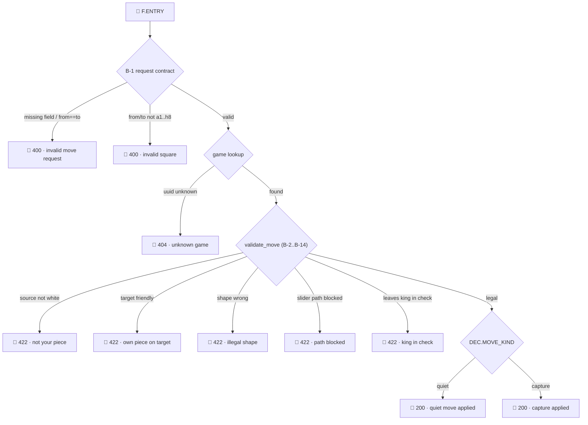
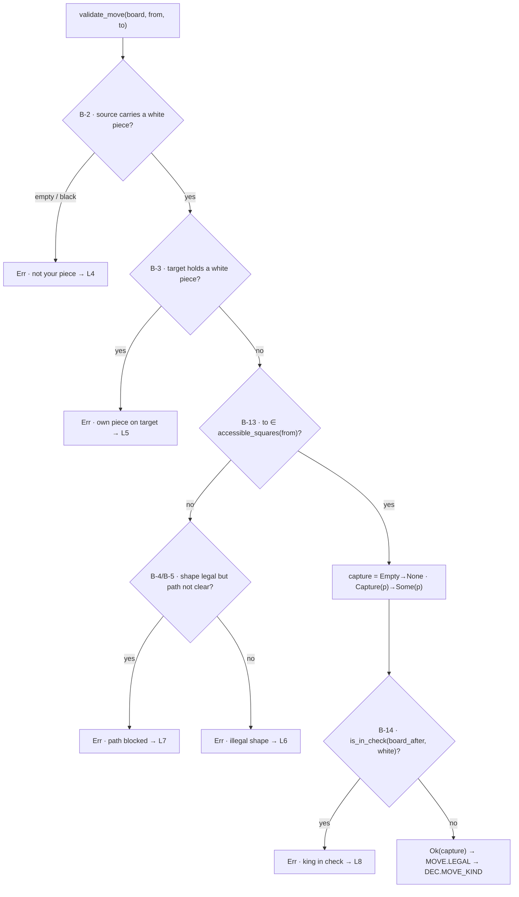

# F0002 — retrospective: the proof lines of *move a piece*

This is a retrospective analysis of the **F0002 (MOVE-A-PIECE)** implementation
seen *through its proof lines* — the execution paths the code actually takes and
logs. It reads the [proof logs](../../global/proof-logs.md) already emitted by the
implementation and distils them into the feature's complete **proof-line tree**,
then zooms into the routine that decides most of it, `validate_move`.

For the general theory behind this — why a proof line *is* an execution path, and
how the tree becomes a matching/coverage tool — see
[proof-line matching](../../global/proof-line-matching.md). This document is the
concrete application to F0002.

---

## 1. What a proof line is here

A **proof line** is the ordered run of proof logs for one execution of the move
endpoint, from the `🚀` Feature Entry to the `🏁` Feature Exit. Different inputs
(different boards, different `from`/`to`) that drive the code down the **same
path** emit the **same** proof line — they are one *family*. Because the move
validator is pure and bounded, the number of feasible paths is **finite and
small**, so the whole feature reduces to a handful of proof lines.

The set of all feasible proof lines, drawn as a tree, **is** the feature's
complete behavioural map: every root-to-leaf path is one proof line; every leaf is
a `🏁` exit.

---

## 2. The proof-line tree of MOVE-A-PIECE

Read directly off the `log_*_f!` call sites in
[`fisher-server/src/lib.rs`](../../../fisher-server/src/lib.rs) (the handler) and
[`fisher-server/src/moves/mod.rs`](../../../fisher-server/src/moves/mod.rs) (the
validator + delegate):

**Ten leaves = ten proof lines = the entire behavioural space of the feature.**
Whatever board arrives, the execution ends on exactly one of these ten.

---

## 3. Where each log is emitted — the step codes

Each proof-log site gets a stable **step code**; the tree's edges are exactly
these steps firing. Line references are current as of this retrospective.

| Step code | Emitted at | Level | Categorical field it carries |
| --------- | ---------- | ----- | ---------------------------- |
| `F.ENTRY` | lib.rs:200 | INFO | — (🚀 marker) |
| `B1.BAD_REQUEST` | lib.rs:190 (via :205, :209) | WARN | `error="invalid move request"` (🏁) |
| `B1.BAD_SQUARE` | lib.rs:190 (via :215) | WARN | `error="invalid square"` (🏁) |
| `B1.REQUEST_VALID` | lib.rs:219 | INFO | `request_valid=true` |
| `B1.UNKNOWN_GAME` | lib.rs:224 | WARN | `error="unknown game"` (🏁) |
| `Bx.ILLEGAL` | moves.rs:357 | WARN | `reason` ∈ the 5-value `IllegalReason` set |
| `F.EXIT` (illegal) | lib.rs:229 | INFO | `result="FAILURE"`, `reason` (🏁) |
| `MOVE.LEGAL` | moves.rs:365 | INFO | `legal=true` |
| `DEC.MOVE_KIND` | moves.rs:369 | INFO | `move_kind ∈ {quiet, capture}` |
| `STATE.BOARD_UPDATED` | moves.rs:374 | INFO | — |
| `STATE.MOVE_RECORDED` | moves.rs:382 | INFO | `taken_count` |
| `F.EXIT` (success) | lib.rs:234 | INFO | `result="SUCCESS"` (🏁) |

Note the 400 branches (`L1`,`L2`) exit **before** `B1.REQUEST_VALID` is logged —
their proof line is just `F.ENTRY → the rejection`. Illegal moves carry **two**
logs after the contract: the validator's `Bx.ILLEGAL` and the handler's `🏁`
exit, both stamped with the same `reason`.

---

## 4. The ten proof lines, enumerated

Each leaf's proof line is the ordered step sequence down to it — its *signature*.

| # | Leaf | Proof-line step sequence | Status |
| - | ---- | ------------------------ | ------ |
| L1 | invalid move request | `F.ENTRY → B1.BAD_REQUEST 🏁` | 400 |
| L2 | invalid square | `F.ENTRY → B1.BAD_SQUARE 🏁` | 400 |
| L3 | unknown game | `F.ENTRY → B1.REQUEST_VALID → B1.UNKNOWN_GAME 🏁` | 404 |
| L4 | not your piece | `F.ENTRY → B1.REQUEST_VALID → Bx.ILLEGAL(not your piece) → F.EXIT 🏁` | 422 |
| L5 | own piece on target | `… → Bx.ILLEGAL(own piece on target) → F.EXIT 🏁` | 422 |
| L6 | illegal shape | `… → Bx.ILLEGAL(illegal shape) → F.EXIT 🏁` | 422 |
| L7 | path blocked | `… → Bx.ILLEGAL(path blocked) → F.EXIT 🏁` | 422 |
| L8 | king in check | `… → Bx.ILLEGAL(king in check) → F.EXIT 🏁` | 422 |
| L9 | quiet move applied | `F.ENTRY → B1.REQUEST_VALID → MOVE.LEGAL → DEC.quiet → STATE.BOARD_UPDATED → STATE.MOVE_RECORDED → F.EXIT 🏁` | 200 |
| L10 | capture applied | `… → MOVE.LEGAL → DEC.capture → STATE.BOARD_UPDATED → STATE.MOVE_RECORDED → F.EXIT 🏁` | 200 |

The eight rejection lines are short (entry → the deciding step → exit); the two
success lines carry the full apply sequence. `L9` and `L10` differ by a **single**
categorical value, `move_kind`.

---

## 5. Inside the deciding node — the `validate_move` routine

Six of the ten leaves (`L4`–`L8`, and the split into `L9`/`L10`) are decided
inside one pure routine,
[`validate_move`](../../../fisher-server/src/moves/mod.rs) (moves.rs:298-334).
This chart zooms into the `VM` node of the tree above — it is the control flow
that produces each `IllegalReason` and the `Ok(capture)` that feeds
`DEC.MOVE_KIND`:

Two structural points worth recording:

- **Pseudo-legality is a single membership test** (rule B-13): `validate_move`
  does not re-derive geometry — it asks whether `to` is in
  `accessible_squares(board, from)`. The `legal_shape`/`path_clear` pair is only
  consulted on the *miss* branch, purely to split `illegal shape` (`L6`) from
  `path blocked` (`L7`). One source of truth for legality, one place to explain a
  refusal.
- **King safety is the last gate** (rule B-14): a move can be perfectly
  pseudo-legal and still fail here (`L8`), because `is_in_check` is evaluated on
  `board_after` — the position the move *would* produce. This is the only leaf
  that depends on the *rest* of the board, not just the two squares — which is why
  it is also the leaf most sensitive to board setup.

---

## 6. Coverage — how the ITs land on the tree

The [IT-F0002](IT-F0002.md) scenarios and the [F0002 examples](F0002.md#examples)
fold onto the ten leaves; many distinct contexts share one proof line:

| Leaf | Contexts that land here (different values, one proof line) |
| ---- | --------------------------------------------------------- |
| `L9` quiet move | `d2→d4`, `e2→e3`, `g1→f3`, `e4→e5`, `e1→f1`, … |
| `L10` capture | `e4→d5` (`capture="p"`), … |
| `L4` not your piece | `e4→e5` (empty source), `d7→d5` (black source) |
| `L5` own piece | `g1→e2` |
| `L6` illegal shape | `d2→d5`, `e2→d3` |
| `L7` path blocked | `d1→d3`, `a1→a4` |
| `L8` king in check | `e2→d3` on the pin board |
| `L1` / `L2` / `L3` | `d2→d2`; `d2→d9`; unknown `uuid` |

**Completeness read-out.** The feature is fully proven at run time iff every one
of the ten leaves is exercised at least once by the ITs. Two useful signals fall
out of this framing:

- an **unhit leaf** in the IT run is a coverage hole — a proof line the tests
  never produced;
- a **production** line that reaches a leaf the ITs never hit is an
  *unproven-path* finding — often exactly where a bug hides.

---

## 7. Observations

- **The feature's whole behaviour is ten proof lines.** The board space is
  astronomically large, but it collapses onto ten execution paths — the honest
  measure of the feature's surface area, and a far better test target than a count
  of hand-written scenarios.
- **The `reason` field is the discriminator.** Five of the leaves differ only by
  the `IllegalReason` they carry; keeping that a closed enum
  ([moves.rs:45](../../../fisher-server/src/moves/mod.rs)) is what keeps the
  rejection leaves cleanly separable in the logs.
- **`L8` (king in check) is the deep one.** Every other leaf is decided by the
  two squares and their immediate geometry; `L8` alone reasons over the full
  `board_after`. It is the family most sensitive to board setup, and the one most
  worth targeting with generated positions (pins, existing checks) rather than
  fixed fixtures.
- **The two charts compose.** The tree (§2) is the feature-level view; the
  `validate_move` chart (§5) is the zoom into its busiest node. Together they show
  every branch that can produce a distinct proof line, end to end.
