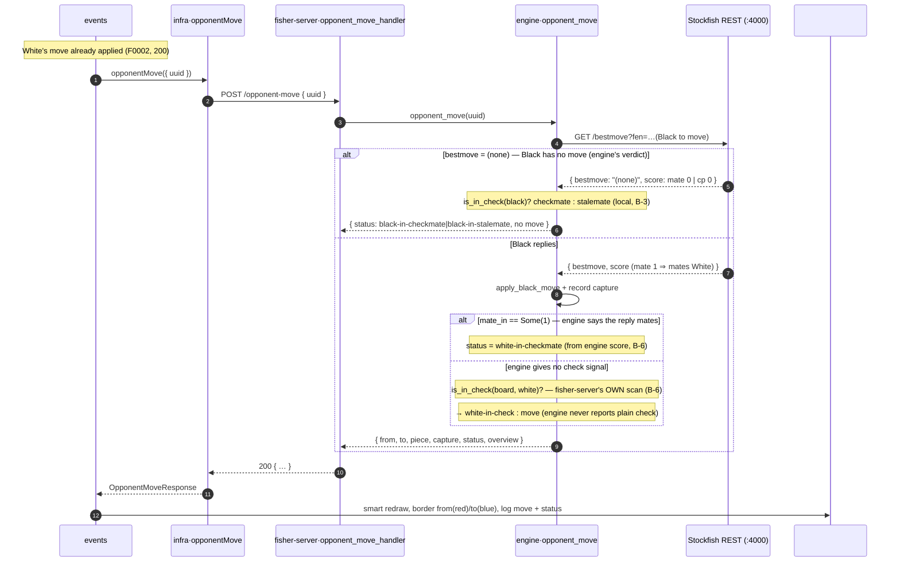

```yaml
id: PLAY-WITH-STOCKFISH
stream-id: GAME-PLAY
type: feature
status: draft
language: TypeScript + Rust
related_entities:
  - GAME
  - MOVE
  - OVERVIEW
  - ENGINE
related_tests:
  - IT-F0003
  - UT-F0003
```

# Goal

After the player (always **White**, per
[F0002](../F0002-move-a-piece/F0002.md)) makes a valid move, the engine answers
for **Black** automatically. The front fires a new endpoint,
`POST /opponent-move` on `fisher-server`, with just the game `uuid`. The server
already holds the position for that `uuid` and knows it is **Black to play**, so
it converts its stored `Overview.board` to a **FEN** string (Black to move) and
asks the **Stockfish** engine for the best reply over the engine's REST API
(`GET /bestmove`, see [architecture.md](../../global/architecture.md) §2.3). It
parses the engine's UCI move, applies it to the board, records any captured
white piece, and works out the resulting **game state** — `move`,
`white-in-check`, `white-in-checkmate`, `black-in-checkmate`, or
`black-in-stalemate`. It returns the **complete board after Black's move**
plus that status. Whether **Black** still has a legal move is the **engine's**
call: Stockfish flags a dead position for the side it plays by answering with no
move (`bestmove (none)`), so `fisher-server` never enumerates Black's moves
itself — it only checks whether Black's king is in check to tell checkmate from
stalemate. Likewise, when Black's reply **mates White**, the engine says so in the
same response (a `mate 1` score), so the server can report `white-in-checkmate`
without generating a single White move. The front redraws from the returned board
(a smart redraw, as
in F0002), **borders the two squares of Black's move** — red for the departure
square, blue for the arrival square — so the player sees what Black played, logs
the move in a console zone, and shows the game status. FEN lives **only** at the
server↔engine boundary; the front and the app contract stay on the `Overview`
model.

**Scope — Black only.** Everything specified here is about **Black's** move (the
Stockfish reply). This feature **does not add, change, or re-validate F0002's
white-move flow** — `POST /move-a-piece`, its move validation, its capture
handling, and its rendering are left exactly as they are. `opponent-move` never
**generates or validates** a White move; the one White-side fact it reports —
`white-in-checkmate` — is read straight from the engine's verdict on Black's
reply (a `mate 1` score), not computed by the server.

---

# Gap

F0002 stops after a single **White** move. Its rule **B-9** states the server
"does **not** flip turn, generate a black move, or call Stockfish", and its
[Out of scope](../F0002-move-a-piece/F0002.md#out-of-scope) defers *Black's reply
(Stockfish engine)* and *checkmate / stalemate detection* to a later feature —
this one. Concretely:

- The back end has no engine module. [`app()`](../../../fisher-server/src/lib.rs)
  mounts `GET /start-game` and `POST /move-a-piece` only; there is no
  `POST /opponent-move`, no `to_fen`, and no HTTP client for the Stockfish REST
  API. F0002 built `accessible_squares`, `is_in_check`, and `board_after`
  ([F0002 → Flow & routines](../F0002-move-a-piece/F0002.md#flow--routines)).
  Game-end detection is **not** built here as a server-side move enumerator:
  Stockfish already recognises a dead position and returns `bestmove (none)`, so
  this feature reads that signal and reuses F0002's `is_in_check` only to split
  checkmate from stalemate.
- The front applies White's move and stops. After the `200` from
  `POST /move-a-piece` it redraws and leaves the two squares highlighted; it
  never asks for Black's reply, has no last-move border styling, no move-log
  zone, and no status display.

This feature closes the loop: the `POST /opponent-move` contract, the FEN
boundary and Stockfish REST call, the apply + capture on Black's move,
checkmate/stalemate detection, and the front-end reflection (redraw, last-move
borders, log, status).

---

# Inputs

One caller input: the game to answer in, sent as a JSON body on
`POST /opponent-move`. The board is **not** sent — the server holds it for the
`uuid` and is the single source of truth
([coding-rules.md](../../global/coding-rules.md) §4). Which side moves is
implicit: the human is White (F0002 rule **B-2**), so `opponent-move` always
computes **Black's** reply.

| Field  | Wire form   | Meaning                                                    |
| ------ | ----------- | ---------------------------------------------------------- |
| `uuid` | string (v4) | The game to answer in — a game F0001 created and F0002 has just moved in. |

The front sends this immediately after `POST /move-a-piece` returns `200` (rule
**F-1**); the player never triggers it directly.

---

# Output

`POST /opponent-move` returns `200 OK` once the engine has answered (or the game
is already over). A malformed body is `400`, an unknown game is `404`, and an
engine failure is `502` (see [Errors](#errors)).

**Black moved** — `200 OK`:

```json
{
  "from": "c7",
  "to": "c5",
  "piece": "p",
  "capture": null,
  "status": "move",
  "overview": {
    "board": [ "… the board after Black's move …" ],
    "white": "both",
    "black": "both"
  }
}
```

**Game already over** (White's prior move left Black with no legal reply — the
engine answers `bestmove (none)`) — `200 OK`, board unchanged:

```json
{ "from": null, "to": null, "piece": null, "capture": null, "status": "black-in-checkmate", "overview": { "…": "…" } }
```

| Field      | Type                     | Notes                                                                     |
| ---------- | ------------------------ | ------------------------------------------------------------------------- |
| `from`     | string `a1..h8` \| `null` | Black's source square, or `null` when Black had no move (rule **B-3**).    |
| `to`       | string `a1..h8` \| `null` | Black's target square, or `null` when Black had no move.                   |
| `piece`    | string \| `null`          | The black piece that moved — **lowercase** (`p n b r q k`), or `null`.     |
| `capture`  | string \| `null`          | The captured **white** piece letter (uppercase), or `null` when not a take. Informational — `overview` already reflects the take (rule **B-8**). |
| `status`   | `GameStatus`             | The game state after the reply — closed set below (rules **B-3**, **B-6**). |
| `overview` | `Overview`               | The board **after** Black's move, authoritative. The front redraws from it (rule **F-2**). |

`GameStatus` is one of:

| Value                    | Meaning                                                                | Emitted |
| ------------------------ | --------------------------------------------------------------------- | ------- |
| `"move"`                 | Black replied; White is now to move and not in check.                  | yes     |
| `"white-in-check"`       | Black's reply gives check — White is now in check (rule **B-6**).       | yes     |
| `"white-in-checkmate"`   | Black's reply **mates White** — the engine scored the reply as `mate 1` (rule **B-6**). Game over, Black wins. | yes     |
| `"black-in-checkmate"`   | **Black** (the engine's side) has no legal move and is in check — White's prior move mated Black (rule **B-3**). Game over, White wins. | yes     |
| `"black-in-stalemate"`   | **Black** has no legal move and is **not** in check — a draw (rule **B-3**). | yes     |
| `"white-in-stalemate"`   | Black's reply stalemates White — a draw.                               | **no — reserved**, see [Out of scope](#out-of-scope) |
| `"draw"`                 | A non-stalemate draw (threefold, 50-move, insufficient material).      | **no — reserved**, see [Out of scope](#out-of-scope) |

Where each status comes from: `black-in-checkmate`/`black-in-stalemate` and
`white-in-checkmate` are the **engine's** verdict (the `(none)`/`mate` signals,
rules **B-3**, **B-6**); **`white-in-check` is computed by `fisher-server`
itself** with `is_in_check(board, white)`, because Stockfish's REST API reports
no plain-check flag (proven in
[Stockfish communication](#stockfish-communication)); `move` is the fall-through.
`white-in-stalemate` — a stalemate that Black's reply inflicts on White — is
**not** detected here (the engine's black turn does not report it distinctly); it
is reserved and returned as `white-in-check`/`move` for now (see
[Out of scope](#out-of-scope)).

The `Overview` shape is unchanged from
[F0001 → Output](../F0001-start-a-game/F0001.md#output). The running list of
captured pieces stays **server-side** on the game (rule **B-8**) — a
captured-pieces panel is still a later feature.

**Note on the user's "capture" case.** A take is reported by the `capture`
**field**, not by `status`, because a capture can coexist with a check or a mate
(e.g. a capturing move that also gives check is `status: "white-in-check"`,
`capture: "P"`). This mirrors F0002's split of `capture` from the verdict.

---

# Engine boundary — FEN & Stockfish REST

This is the one place in the app where **FEN** appears. F0001/F0002 keep FEN out
of the app contract; here `fisher-server` speaks FEN **only** to the engine, then
returns to the `Overview` model.

**FEN serialization** — `to_fen(overview) -> String` (rule **B-4**). The six FEN
fields are built from the stored `Overview`, with **Black to move** — the only
side the engine is ever asked about:

| FEN field         | Value                                                                             |
| ----------------- | --------------------------------------------------------------------------------- |
| Piece placement   | `overview.board` rows `0..7` (rank 8 → rank 1), files `a..h` left to right, letters as-is (uppercase white, lowercase black), empty runs collapsed to digits, rows joined by `/`. `board[0]` is already rank 8, so the order matches FEN directly. |
| Active colour     | always `b` — `opponent-move` only ever asks the engine for **Black's** move.       |
| Castling          | `-` — the app does not perform castling (deferred, F0002). Advertising `-` stops the engine from replying with a castling move the apply step (a single piece move) could not carry out. |
| En passant        | `-` — en passant is out of scope; the engine is never offered it.                 |
| Halfmove clock    | `0` — move history is not tracked yet.                                             |
| Fullmove number   | `1` — move history is not tracked yet.                                             |

**The REST call** — `best_move(fen) -> Result<EngineReply, EngineError>` (rule
**B-5**). Issue `GET {ENGINE_BASE}/bestmove?fen=<url-encoded FEN>&depth=<DEPTH>`
against the Stockfish image
([architecture.md](../../global/architecture.md) §2.3). `ENGINE_BASE` defaults to
`http://localhost:4000` and lives in **one** constant/config, not scattered
across call sites; `DEPTH` is a fixed default constant (engine-difficulty as a
game setting is [out of scope](#out-of-scope)). The engine answers:

```json
{ "result": { "bestmove": "c7c5", "ponder": "g1f3", "info": [ "…", { "depth": 15, "score": { "unit": "cp", "value": -52 }, "pv": "c7c5 …" } ] }, "fen": "…", "info": { "stockfish_version": "14.1" } }
```

`best_move` reads **two** things from `result` and drops the rest
(`ponder`, PV, etc.):

```
EngineReply {
  best:    Option<UciMove>,   // the parsed bestmove, or None when bestmove == "(none)"
  mate_in: Option<i32>,       // signed mate distance from the deepest info line's score
}                             //   Some(n) when its score.unit == "mate"; None for a "cp" score
```

`mate_in` is taken from the **deepest** `result.info` entry (highest `depth`) —
the line the engine actually committed to. It is what lets the server report
`white-in-checkmate` (`mate_in == Some(1)`, rule **B-6**) without ever asking the
engine about White. The exact shapes for every game case are in
[Stockfish communication](#stockfish-communication).

**One call per turn, Black only.** `opponent-move` asks the engine exactly once,
for **Black's** move. That single answer carries both the black-side
move-existence verdict (`best` is a move, or `None` = Black
checkmated/stalemated, rule **B-3**) and the `mate 1` flag that reveals a
White-mating reply (rule **B-6**). `fisher-server` never asks the engine about
White and never enumerates moves of its own.

**Parsing** — `parse_uci(s) -> UciMove { from, to, promo }` (rule **B-5**). A
`bestmove` is UCI long-algebraic: two squares and an **optional** promotion
letter, e.g. `c7c5` (`from="c7"`, `to="c5"`, `promo=None`) or `a2a1q`
(`promo=Some('q')`). A `bestmove` of `"(none)"` means **Black** has **no legal
move**; `best_move` returns `EngineReply { best: None, … }` and the caller reads
it as checkmate/stalemate (rule **B-3**) — it is **not** an error.

---

# Stockfish communication

The four game cases the server must tell apart were probed directly against the
running `ghcr.io/samuraitruong/stockfish-docker:14.1` container
(`GET http://localhost:4000/bestmove?fen=<FEN>&depth=12`, Black to move in each).
The response format is stable across cases: a `result.bestmove` string (a move or
`"(none)"`), a `result.info` array of PV lines each carrying a `score`
(`{ "unit": "cp" | "mate", "value": n }`), an optional `result.ponder`, the
echoed `fen`, and a top-level `info.stockfish_version`. **Two fields decide the
status: `result.bestmove` and the deepest line's `score`.**

| Chess case (Black to move) | `bestmove` | Deepest `score` | `ponder` | ⇒ F0003 `status` |
| -------------------------- | ---------- | --------------- | -------- | ---------------- |
| Ordinary reply             | a move, e.g. `c7c5` | `{ "unit": "cp", "value": n }` | present | `move` or `white-in-check` (by `is_in_check`, rule **B-6**) |
| Black's reply mates White  | a move, e.g. `d8h4` | `{ "unit": "mate", "value": 1 }` | absent | `white-in-checkmate` (rule **B-6**) |
| Black is checkmated        | `"(none)"` | `{ "unit": "mate", "value": 0 }` | absent | `black-in-checkmate` (rule **B-3**) |
| Black is stalemated        | `"(none)"` | `{ "unit": "cp", "value": 0 }` | absent | `black-in-stalemate` (rule **B-3**) |

**Sampled requests & responses** (bodies trimmed to the deciding fields):

*Ordinary reply* — `fen=rnbqkbnr/pppppppp/8/8/4P3/8/PPPP1PPP/RNBQKBNR b KQkq e4 0 1`:

```json
{ "result": { "bestmove": "c7c5", "ponder": "g1f3",
  "info": [ …, { "depth": 15, "score": { "unit": "cp", "value": -52 }, "pv": "c7c5 g1f3 …" } ] }, "info": { "stockfish_version": "14.1" } }
```

*Reply mates White (fool's mate)* —
`fen=rnbqkbnr/pppp1ppp/8/4p3/6P1/5P2/PPPPP2P/RNBQKBNR b KQkq - 0 1`:

```json
{ "result": { "bestmove": "d8h4",
  "info": [ …, { "depth": 1, "score": { "unit": "mate", "value": 1 }, "pv": "d8h4" } ] }, "info": { "stockfish_version": "14.1" } }
```

*Black checkmated (Scholar's mate)* —
`fen=r1bqkb1r/pppp1Qpp/2n2n2/4p3/2B1P3/8/PPPP1PPP/RNB1K1NR b KQkq - 0 4`:

```json
{ "result": { "bestmove": "(none)",
  "info": [ { "string": "NNUE …" }, { "depth": 0, "score": { "unit": "mate", "value": 0 } } ] }, "info": { "stockfish_version": "14.1" } }
```

*Black stalemated* — `fen=7k/5Q2/6K1/8/8/8/8/8 b - - 0 1`:

```json
{ "result": { "bestmove": "(none)",
  "info": [ { "string": "NNUE …" }, { "depth": 0, "score": { "unit": "cp", "value": 0 } } ] }, "info": { "stockfish_version": "14.1" } }
```

Notes drawn from the probes: `ponder` is present on an ordinary reply but
**absent** on a mating move and on `(none)`, so it is optional and must not be
required (the server ignores it). Both terminal cases return the **same**
`bestmove: "(none)"`; only the `score.unit` (`mate` vs `cp`) separates checkmate
from stalemate — which is why the server may split them from the engine alone,
though rule **B-3** uses `is_in_check(board, black)` for that split. A
`mate 1` score on an *applied* move is the sole basis for `white-in-checkmate`
(rule **B-6**); a stalemate that Black inflicts on White carries no such distinct
signal (its `score` is a drawish `cp`), which is why `white-in-stalemate` stays
[out of scope](#out-of-scope).

**Plain check has NO engine signal — `white-in-check` is fisher-server's own
call.** Probing an in-check position against a quiet one confirmed the engine
never flags check. Both `GET /bestmove` responses below are structurally
identical — same fields, a `cp` score, and **no** `check`/`inCheck`/`checkers`
field anywhere; only the move and eval differ:

| Position (White to move) | FEN | `bestmove` | Deepest `score` | Check flag? |
| ------------------------ | --- | ---------- | --------------- | ----------- |
| White **in check**       | `4r3/8/8/8/k7/8/8/4K3 w - - 0 1` | `e1f2` | `{ "unit": "cp", "value": -549 }` | none |
| White **not** in check   | `5r2/8/8/8/k7/8/8/4K3 w - - 0 1` | `e1e2` | `{ "unit": "cp", "value": -553 }` | none |

The image also exposes no display/debug endpoint (`/d`, `/display`, `/eval`,
`/board`, `/check`, `/status`, `/info` all return `404`; only `/` and
`/bestmove` exist), so there is no way to read Stockfish's internal "Checkers"
line over REST. Therefore `white-in-check` **must** be computed by `fisher-server`
itself with `is_in_check(board, white)` — the engine cannot supply it (rules
**B-6**, **B-7**). This is unlike `white-in-checkmate`, which *does* have an
engine signal (the `mate 1` score) and so is read from the reply.

---

# Flow & routines

The routines below are the contract the tests pin. The front keeps the role
split from [coding-rules.md](../../global/coding-rules.md) §1: `events` owns the
DOM and orchestration, `infra` owns the network, `domain` is pure. The back end
keeps a thin handler that delegates to a **business-named** `engine` routine and
logs each step with the game `uuid` ([coding-rules.md](../../global/coding-rules.md)
§2; proof-log placement in [proof-logs.md](../../global/proof-logs.md)).

**Front — `chessgame/src/`**

| Routine | Folder · signature | Responsibility |
| --- | --- | --- |
| `playOpponent` | `events` · `playOpponent(uuid: string): Promise<void>` | Fired right after a valid White move is applied (rule **F-1**). Calls `infra.opponentMove`, then reflects the reply via `applyOpponentMove`, or shows a game-over / engine-error message. |
| `opponentMove` | `infra` · `opponentMove(req: { uuid: string }): Promise<OpponentMoveResponse>` | The only network seam for the reply (rule **F-5**). Issues `POST /opponent-move`; resolves `200` into the outcome and **throws** on `400`/`404`/`502`/network. |
| `applyOpponentMove` | `events` · `applyOpponentMove(resp: OpponentMoveResponse): void` | DOM writer. **Smart redraw** from `resp.overview` (rule **F-2**), then border `from` red and `to` blue (rule **F-3**), append the move to the log zone (rule **F-4**), and show `resp.status` (rule **F-4**). |

**Back — `fisher-server/src/`**

| Routine | Module · signature | Responsibility |
| --- | --- | --- |
| `opponent_move_handler` | `lib` · `POST /opponent-move` | Thin Axum handler: validate the body (`uuid` present), look up the game, delegate, map the outcome to `200` / `404` / `502` (rules **B-1**, **B-9**). |
| `opponent_move` | `engine` · `opponent_move(registry, uuid, session, tracking) -> OpponentOutcome` | Business delegate: load the game's `Overview`; ask the engine for Black's reply (`to_fen` → `best_move`); on `best: None` return the black-side game-over status (rule **B-3**); else `parse_uci`, apply the move + record any capture (rules **B-6a**, **B-8**), score the resulting position from `is_in_check` + the reply's `mate_in` (rule **B-6**), return the outcome. |
| `to_fen` | `engine` · `to_fen(overview) -> String` | Pure. Serialize the position with **Black to move** (rule **B-4**; see [Engine boundary](#engine-boundary--fen--stockfish-rest)). |
| `best_move` | `engine` · `best_move(fen) -> Result<EngineReply, EngineError>` | Call the Stockfish REST API; return `EngineReply { best, mate_in }` — `best` is `None` when `result.bestmove` is `"(none)"`, `mate_in` is the deepest line's mate distance (rule **B-5**; see [Engine boundary](#engine-boundary--fen--stockfish-rest)). |
| `parse_uci` | `engine` · `parse_uci(s) -> UciMove` | Pure. Split a UCI move into `from`, `to`, optional `promo` (rule **B-5**). |
| `apply_black_move` | `engine` · `apply_black_move(board, uci) -> (Vec<Vec<String>>, Option<Capture>)` | Pure. The board with Black's move applied — `from` cleared, `to` set to the moving piece (or the promoted piece, rule **B-6a**) — plus any captured white piece (rule **B-8**). Built on F0002's `board_after`. |
| `game_status` | `moves` · `game_status(board, mate_in) -> GameStatus` | Pure. After Black's reply: `mate_in == Some(1)` → `white-in-checkmate`; else `white-in-check` when `is_in_check(board, white)` else `move` (rule **B-6**). It does **not** compute a White `stalemate` — that would need White's move existence, which is not queried (rule **B-7**). |

**Reused unchanged from F0002:** `is_in_check` and `board_after` (see
[F0002 → Flow & routines](../F0002-move-a-piece/F0002.md#flow--routines)).
`is_in_check` is an attack scan over a single king, not a legal-move enumeration.
Whether **Black** has a legal move — and whether Black's reply mates White — is
delegated to the engine (rules **B-3**, **B-6**), so this feature adds **no**
move-generation routine.

**Walkthrough — one Black reply, request to reflected**

1. **The front asks for the reply.** After `POST /move-a-piece` returns `200`
   and White's move is drawn (F0002 rule **F-5**), `events` calls
   `infra.opponentMove({ uuid })` — the single seam (rule **F-1**).
2. **Ask the engine for Black's reply.** `opponent_move` builds the Black-to-move
   FEN with `to_fen(overview)` and calls `best_move(fen)`, which returns
   `EngineReply { best, mate_in }` — `GET /bestmove` on the Stockfish REST API
   (rules **B-4**, **B-5**).
3. **`best: None` means Black is done.** If the engine answers with no move,
   **Black** has no legal move: the status is `black-in-checkmate`
   (`is_in_check(board, black)`) or `black-in-stalemate`, the board is untouched,
   and `from/to/piece/capture` are `null` (rule **B-3**). No move is applied.
4. **Apply Black's move — data, not UI.** Otherwise `parse_uci` splits the reply
   and `apply_black_move` clears `from`, writes the black piece (or its
   promotion) onto `to`, and reports any captured **white** piece; `opponent_move`
   appends that piece to the game's taken list and stores the updated `Overview`
   in the registry keyed by `uuid` (rules **B-6a**, **B-8**).
5. **Score the position.** `game_status(board, mate_in)` returns
   `white-in-checkmate` when the reply's `mate_in == Some(1)` (the engine's own
   verdict that the move mates), else `white-in-check` when `is_in_check(board,
   white)`, else `move` (rule **B-6**) — no White engine query. The server returns
   `200 { from, to, piece, capture, status, overview }`.
6. **The front reflects the reply.** `events.applyOpponentMove` redraws from the
   returned `overview` (rule **F-2**), borders Black's `from` square red and `to`
   square blue (rule **F-3**), appends the move to the log zone, and shows the
   status (rule **F-4**). On a `502` it shows an engine-error message and leaves
   the board as it was (rule **F-6**).

**Sequence — White move to Black reply**



In the diagram, only the `GET /bestmove` arrows cross to Stockfish; every
`is_in_check` note stays inside `fisher-server` — including the `white-in-check`
decision, which the engine cannot provide (rule **B-6**).

The unit tests ([UT-F0003](unit_test_F0003.md)) target `to_fen`, `parse_uci`,
`game_status`, and the front reflection with `infra.opponentMove` mocked; the
integration tests ([IT-F0003](IT-F0003.md)) drive `opponent_move_handler` over
HTTP against a live engine.

---

# Rules

Rules split into the back-end contract (`B-*`) and the front-end interaction
(`F-*`). This feature covers **one Black reply per call** and the game-state
verdict; everything not listed here is [out of scope](#out-of-scope). Every rule
below acts on **Black's** move only — none add or alter White-side move
generation, validation, or scoring (see the Goal's *Scope — Black only*).

**Back end**

1. **B-1 — Endpoint & request contract.** `POST /opponent-move` accepts a JSON
   body `{ uuid }`. The handler validates that the body is well-formed and that
   `uuid` names a known game. A malformed body is `400`; an unknown `uuid` is
   `404` (see [Errors](#errors)). Only then does it delegate to
   `engine::opponent_move`.

2. **B-2 — Black only, position is server-held.** The reply is always **Black's**
   (the human is White, F0002 rule **B-2**). The server uses the `Overview` it
   already stores for the `uuid`; the request carries no board. There is no
   turn-ownership check — the front calls this only after a valid White move
   (turn enforcement / `409` stays [out of scope](#out-of-scope)).

3. **B-3 — Black's move existence is the engine's call.** Whether **Black** has a
   legal move is **Stockfish's** responsibility, not the server's. `opponent_move`
   builds the Black-to-move FEN and calls the engine; if the engine answers
   `(none)` (`best_move` → `EngineReply { best: None, … }`), Black has no legal
   move. The server then reads `is_in_check(board, black)`: `true` →
   `status: "black-in-checkmate"`,
   `false` → `status: "black-in-stalemate"`. The stored board is left
   **unchanged**, and `from`,
   `to`, `piece`, and `capture` are all `null`. This is how a White move that
   mates or stalemates Black is reported. The server never enumerates Black's
   moves itself.

4. **B-4 — FEN serialization (Black to move).** `to_fen(overview)` produces a
   valid FEN string with active colour `b` — the only side the engine is asked
   about — castling `-`, en passant `-`, halfmove `0`, fullmove `1`, and the
   piece placement mapped directly from `overview.board` (see
   [Engine boundary](#engine-boundary--fen--stockfish-rest)). FEN appears **only**
   here; it never enters the app contract or the front.

5. **B-5 — Engine call & reply parse.** `best_move` issues
   `GET {ENGINE_BASE}/bestmove?fen=<encoded>&depth=<DEPTH>` against the Stockfish
   REST image and builds `EngineReply { best, mate_in }` from `result`: `best` is
   `Some(parse_uci(bestmove))` for a move (`from`, `to`, optional promotion
   letter) or `None` when `result.bestmove == "(none)"` (a legal, non-error signal
   used by rule **B-3**); `mate_in` is the signed mate distance of the **deepest**
   `result.info` line — `Some(n)` when its `score.unit == "mate"`, `None` for a
   `"cp"` score (see [Stockfish communication](#stockfish-communication)).
   `ENGINE_BASE` (default `http://localhost:4000`) and `DEPTH` live in one
   constant/config. Any transport or protocol failure — unreachable, timeout,
   non-2xx, or an unparseable/missing `bestmove` — surfaces as `EngineError` →
   `502` (rule **B-9**).

6. **B-6 — Game status after Black's reply.** Once Black's move is applied,
   `game_status(board, mate_in)` classifies the resulting position for the side
   now to move (**White**):

   - `mate_in == Some(1)` → **`white-in-checkmate`**. The engine scored Black's
     reply as mate-in-1, i.e. the applied move checkmates White. This is the
     engine's own verdict — the server does not generate any White move to reach
     it.
   - else `is_in_check(board, white)` → **`white-in-check`**.
   - else → **`move`**.

   **`white-in-check` must be determined by `fisher-server` itself.** Stockfish's
   REST API carries **no** check flag — a checking reply looks like any other
   `cp`-scored move, and the image exposes no display/debug endpoint
   ([Stockfish communication](#stockfish-communication) proves both). So the
   engine **cannot** supply this status; the server decides it locally with
   `is_in_check(board, white)`, the F0002 attack scan. This is the one place the
   status is computed rather than read from the engine — deliberately, because
   the engine offers no alternative. (`white-in-checkmate`, by contrast, *is* read
   from the engine's `mate 1` score.)

   The server does **not** compute a `white-in-stalemate`: a stalemate Black
   inflicts on White has no distinct engine signal on the black turn (its score is
   a drawish `cp`), so that status is reserved and deferred (see
   [Out of scope](#out-of-scope)). `black-in-checkmate`/`black-in-stalemate` come
   from rule **B-3**.

7. **B-7 — No server-side move enumeration.** `fisher-server` runs no
   legal-move generator in this feature. "Does **Black** have a legal move?" and
   "does Black's reply mate White?" are both answered **only** by the engine —
   `best`/`(none)` (rule **B-3**) and the `mate_in` score (rule **B-6**). F0002's
   `is_in_check` is reused solely to distinguish `black-in-checkmate` from
   `black-in-stalemate` (rule **B-3**) and `white-in-check` from `move` (rule
   **B-6**) — it is an attack scan over a single king, not an enumeration of
   moves. `accessible_squares` is **not** invoked by this feature except
   transitively inside `is_in_check`.

8. **B-8 — Apply the reply & record the take.** On an engine move the server
   updates the game's stored `Overview` in the registry keyed by `uuid`:
   `board[from]` becomes `""` and `board[to]` becomes the moving black piece. If
   `to` held a **white** (uppercase) piece, that piece is the `capture` and is
   **appended to the game's taken-pieces list** (the list now holds captured
   pieces of either colour). A game-over result (rule **B-3**) changes nothing.
   Castling-availability fields (`overview.white`, `overview.black`) are carried
   **unchanged**.

   a. **B-6a — Promotion in the engine reply.** When `parse_uci` yields a
   promotion letter (a black pawn reaching rank 1), `board[to]` becomes that
   piece as a **lowercase** letter (e.g. `q`), not the pawn. Castling and en
   passant cannot appear in the reply because the FEN offers neither (rule
   **B-4**), so no rook-move or captured-pawn side effect is needed.

9. **B-9 — Response & failure contract.** The success path returns
   `200 { from, to, piece, capture, status, overview }`. A malformed body is
   `400` and an unknown game is `404` (bad request, not gameplay). An engine
   failure — unreachable, timeout, non-2xx, or an unparseable/missing `bestmove`
   — is `502 Bad Gateway`, `{ "error": "engine unavailable" }` (the `5xx engine
   failure` of [coding-rules.md](../../global/coding-rules.md) §2.2). A
   `bestmove` of `"(none)"` is **not** a failure — it is the normal black-side
   game-over signal (rule **B-3**).

10. **B-10 — CORS.** The route answers cross-origin requests from the front dev
    origin `http://localhost:5173` for the `POST` method, extending the F0002
    CORS layer per [architecture.md](../../global/architecture.md) §6.

**Front end**

11. **F-1 — Auto-trigger after a valid White move.** As soon as
    `infra.movePiece` resolves `200` and `events.applyValidMove` has drawn
    White's move (F0002 rules **F-5**, **F-7**), `events` calls
    `events.playOpponent(uuid)`. The player does not trigger the reply.

12. **F-2 — Reflect the reply by redrawing from the returned board.** On a `200`
    the front does **not** hand-move pieces. It takes `resp.overview` — the
    authoritative board after Black's move — and **smart-redraws** it exactly as
    F0002 rule **F-5** does: rebuild the model with `domain.buildBoard(overview)`
    and patch **only** the squares whose content changed. When
    `resp.from`/`resp.to` are `null` (game over before the reply, rule **B-3**)
    there is nothing to redraw.

13. **F-3 — Border Black's last move.** After the redraw, the front borders the
    two squares of Black's move so the player can see it: the **departure**
    square (`resp.from`) gets a **red** border and the **arrival** square
    (`resp.to`) gets a **blue** border. These borders are the black-reply
    highlight, distinct from the White-selection highlight of F0002. They are
    cleared when the player begins the next White move (F0002 rule **F-9**
    resets highlights on a new source click).

14. **F-4 — Log the move and show the status.** The front appends Black's move
    to a **log/console zone** on the page (e.g. `from`→`to`, or `"(none)"` when
    the game was already over) and displays `resp.status` (`move`/
    `white-in-check`/`white-in-checkmate`/`black-in-checkmate`/
    `black-in-stalemate`). On `white-in-checkmate`, `black-in-checkmate`, or
    `black-in-stalemate` the game is over and no further White move is expected.

15. **F-5 — Single network seam.** Only `infra.opponentMove` calls
    `POST /opponent-move` and reads the response; it resolves `200` into an
    `OpponentMoveResponse` and **throws** on any other status (`400`/`404`/`502`/
    network). `events` owns all DOM writes; `domain` stays pure. This mirrors
    [coding-rules.md](../../global/coding-rules.md) §1 and F0002 rule **F-7**.

16. **F-6 — Handle an engine failure.** If `infra.opponentMove` throws (a `502`
    or network error), the front shows an engine-error message in the log zone
    and leaves the board and White's highlights as they were — no partial reply.

**Unchanged / not introduced:** the **White side is entirely untouched** — F0002's
`POST /move-a-piece`, its move validation, capture handling, and rendering keep
their exact behaviour, and this feature adds no White move generation, validation,
or checkmate/stalemate scoring. Also: no FEN in the front or the app contract (it
lives only at the server↔engine boundary, rule **B-4**); no turn-ownership check /
`409` (rule **B-2**); no drag-and-drop, no board flip; no captured-pieces or
move-list panel beyond the minimal log zone (rule **F-4**); no engine-difficulty
setting; no non-stalemate draw detection. F0001's `GET /start-game` and F0002's
`POST /move-a-piece` and `POST /private/setup-board` contracts are untouched.

---

# Errors

The success path is `200` (Black replied, or the game was already over — both are
normal outcomes carried by `status`). Everything else is a request or engine
fault.

| Condition                                          | Stage that rejects        | Outcome                                                       |
| -------------------------------------------------- | ------------------------- | ------------------------------------------------------------ |
| Body missing/not JSON, `uuid` absent               | handler input validation  | `400 Bad Request`, JSON `{ "error": "invalid opponent-move request" }` |
| `uuid` names no game in the registry               | handler / registry lookup | `404 Not Found`, JSON `{ "error": "unknown game" }`          |
| Engine unreachable / timeout / non-2xx             | `engine::best_move` (**B-5**) | `502 Bad Gateway`, JSON `{ "error": "engine unavailable" }` |
| `bestmove` missing or unparseable (not `"(none)"`) | `engine::best_move` (**B-5**) | `502 Bad Gateway`, JSON `{ "error": "engine unavailable" }` |
| Back end unreachable / other non-2xx               | front `infra.opponentMove` | Surfaces to `events` as a real error (rule **F-6**); board left untouched |

A `bestmove` of `"(none)"` is **not** in this table — the engine reporting that
**Black** has no legal move is the normal `black-in-checkmate`/`black-in-stalemate`
path (rule **B-3**), returned as `200`.

`black-in-checkmate`/`black-in-stalemate` are **not** errors — they are `200`
with the matching `status` (rule **B-3**). The F0001/F0002 error contracts are
unrelated to this route and stay unchanged. `409 not your turn` belongs to a
later turn-ownership feature and is not emitted here (rule **B-2**).

---

# Examples

Rows assume a game started via `GET /start-game` and, where a board is given,
seeded with F0002's `POST /private/setup-board`
([F0002 → Test-support API](../F0002-move-a-piece/F0002.md#test-support-api--post-privatesetup-board)).
Input is `{ uuid }`; output is the `status` and Black's move.

**Opening reply.** After White plays `e2→e4` (via `POST /move-a-piece`), the
stored board is the start position with a white pawn on `e4`, Black to move.

| Call | Engine `bestmove` | Response |
| ---- | ----------------- | -------- |
| `POST /opponent-move { uuid }` | `c7c5` | `200 { from:"c7", to:"c5", piece:"p", capture:null, status:"move" }` — the Sicilian; `overview` has the black pawn moved `c7`→`c5`. |

**A capture (apply logic).** When the engine's reply lands on a white piece, that
piece is the `capture` and is removed from the board.

| Engine `bestmove` | Result |
| ----------------- | ------ |
| `e5d4` onto a white pawn on `d4` | `capture:"P"`, `piece:"p"`; `board[e5]=""`, `board[d4]="p"`, `"P"` appended to the taken list (rule **B-8**). |

**A check.** Given this position — White `K` `e1`, Black `r` `a8`, Black `k` `a4`,
the `e`-file empty — Black to move plays `a8→e8`:

```json
"board": [
  ["r","","","","","","",""],
  ["","","","","","","",""],
  ["","","","","","","",""],
  ["","","","","","","",""],
  ["k","","","","","","",""],
  ["","","","","","","",""],
  ["","","","","","","",""],
  ["","","","","K","","",""]
]
```

| Engine `bestmove` | Response |
| ----------------- | -------- |
| `a8e8` | `200 { from:"a8", to:"e8", piece:"r", capture:null, status:"white-in-check" }` — the rook attacks `K` `e1` down the open file; `is_in_check(board, white)` is `true`, so `white-in-check` (rule **B-6**). |

**Black mates White (`white-in-checkmate`).** From the start position White has
played `f2→f3` and `g2→g4`, and Black has played `e7→e5`; it is Black to move and
`d8h4` is `Qh4#`:

```json
"board": [
  ["r","n","b","q","k","b","n","r"],
  ["p","p","p","p","","p","p","p"],
  ["","","","","","","",""],
  ["","","","","p","","",""],
  ["","","","","","","P",""],
  ["","","","","","P","",""],
  ["P","P","P","P","P","","","P"],
  ["R","N","B","Q","K","B","N","R"]
]
```

| Engine `bestmove` (score) | Response |
| ------------------------- | -------- |
| `d8h4` (`mate 1`) | `200 { from:"d8", to:"h4", piece:"q", capture:null, status:"white-in-checkmate" }` — the engine scored the reply as `mate 1`, so applying `d8h4` mates White; `mate_in == Some(1)` yields `white-in-checkmate` with no White move generated (rule **B-6**; see [Stockfish communication](#stockfish-communication)). |

**Black checkmated (`black-in-checkmate`).** If White's own last move checkmated
Black, the front still fires `opponent-move`, but the engine has no Black reply:

| Call | Response |
| ---- | -------- |
| `POST /opponent-move { uuid }` | `200 { from:null, to:null, piece:null, capture:null, status:"black-in-checkmate" }` — the engine answers `bestmove (none)` (score `mate 0`) for Black, so the board is unchanged and `is_in_check(board, black)` makes it `black-in-checkmate` (rule **B-3**). |

**Engine down.**

| Call | Response |
| ---- | -------- |
| `POST /opponent-move { uuid }` (Stockfish container stopped) | `502 { "error": "engine unavailable" }` (rule **B-9**). |

These rows double as test oracles for [IT-F0003](IT-F0003.md). The engine-driven
rows (opening, the `Qh4` mate) rely on a forced or clearly-best reply and match
the sampled responses in [Stockfish communication](#stockfish-communication); the
capture and check rows exercise the apply/status logic independently of the
engine's choice.

---

# Implementation surface (informative)

The routines and their files are in [Flow & routines](#flow--routines). This
section adds only the **non-routine deltas**.

| Path                          | Delta (beyond the routines above)                                        |
| ----------------------------- | ------------------------------------------------------------------------ |
| `fisher-server/Cargo.toml`    | Add an HTTP client (e.g. `reqwest`) for the Stockfish REST call.          |
| `fisher-server/src/lib.rs`    | Mount `opponent_move_handler`; extend the CORS layer to the new `POST` route (rule **B-10**). |
| `fisher-server/src/engine/`   | New business module: `opponent_move` (one engine call, Black only), `to_fen(overview)`, `best_move` (→ `EngineReply { best, mate_in }`), `parse_uci`, `apply_black_move`, `EngineReply`/`EngineError`, the `ENGINE_BASE`/`DEPTH` config. |
| `fisher-server/src/moves/`    | Add `game_status(board, mate_in)`; reuse `is_in_check` and `board_after` unchanged. **No** move-enumeration routine — Black's move existence and White's mate both come from the engine (rule **B-7**). |
| `fisher-server/src/proof_log.rs` | Add a `PlayWithStockfish` stream variant (tag `PLAY-WITH-STOCKFISH`). |
| `chessgame/src/infra/`        | `opponentMove` — the `POST /opponent-move` seam.                          |
| `chessgame/src/events/`       | `playOpponent`, `applyOpponentMove`; chain from the F0002 valid-move path (rule **F-1**). |
| `chessgame/src/style.css`     | Red/blue last-move borders (rule **F-3**); the log/status zone (rule **F-4**). |

**Not touched (White-move flow & prior features):** F0002's white-move code —
`move_piece_handler`, `move_piece`, `validate_move`, and the front's
`onSquareClick`/`applyValidMove` — is left as-is; no White move is generated or
validated (the one White-side status, `white-in-checkmate`, is read from the
engine, not computed — rule **B-6**). F0001 `GET /start-game`, F0002
`POST /move-a-piece` and `POST /private/setup-board`, the `Overview` model, and
persistence are all unchanged.

---

# Out of scope

This feature delivers **one Black reply per call**, black-side game-over
detection, and `white-in-checkmate`. It is the single reply, **not** the
continuous play loop that stitches replies together into a full game — the board
gating, game-over halt, and failure recovery that make the game robustly playable
are deferred below. Each item lands later:

- **Front-end input gating during the engine's turn** — F0003 fires the reply on
  a valid White move (rule **F-1**) and reflects it (**F-2**–**F-4**), but it does
  **not** lock the board while the engine is thinking. Between `playOpponent`
  firing and the reply landing, White clicks stay live, so a second White move can
  race the pending reply. A board-state gate (idle → engine-thinking → idle) that
  disables White input for the duration is deferred; until then the loop assumes
  the player waits for the reply.
- **Halting the board on game over** — rule **F-4** says the game is over on
  `white-in-checkmate` / `black-in-checkmate` / `black-in-stalemate`, but nothing
  **enforces** it: the front does not hard-lock the board after a terminal status,
  so callers must not rely on it to stop further White moves. A game-over lock
  (until a new game / F0001 rematch) is deferred.
- **Engine-failure recovery** — on a `502` (rule **F-6**) White's move is already
  applied and stored but Black never replied, leaving the game mid-turn. F0003
  defines no retry path: re-issuing `opponent-move` for the same position (rather
  than the player having to move White again) is deferred.
- **Engine play from a `random` position** — `opponent-move` assumes the stored
  board is a legal, standard game (from `GET /start-game` standard mode plus
  `POST /move-a-piece`). F0001's `random` mode is a dev render aid, not a legal
  game; serializing such a board to Stockfish is **undefined** here (the engine
  may reply oddly or return `(none)`). Engine play is standard-mode only for now.
- **Whose-turn / "engine is thinking" indicator** — the only feedback is the
  after-the-fact log line (rule **F-4**); a live thinking / turn indicator during
  the async wait (the [architecture.md](../../global/architecture.md) §2.1 "whose
  turn" panel) is deferred.

- **`white-in-stalemate` (Black's reply stalemates White)** — the server reads
  White's mate from the engine's `mate 1` score on Black's reply (rule **B-6**),
  but a *stalemate* Black inflicts on White has **no** distinct signal on the
  black turn: the reply's score is just a drawish `cp`, indistinguishable from an
  ordinary quiet move. So `white-in-stalemate` is reserved but never emitted; a
  reply that stalemates White comes back as `move` (or `white-in-check` if it also
  checks — which a stalemate never does). Detecting it needs White's move
  existence — a White engine query or a server-side generator — in a later
  feature. Playability note: until then a stalemated human sees `move`, finds
  every reply illegal (F0002 **B-14**), and gets no message — a known soft-lock.
- **Turn ownership / `409 not your turn`** — no whose-turn enforcement; the reply
  trusts that the front calls it only after a valid White move (rule **B-2**).
- **Non-stalemate draws** — threefold repetition, the 50-move rule, and
  insufficient material are **not** detected; the `status: "draw"` value is
  reserved for them but never emitted (they need move history, which is not
  tracked — hence FEN halfmove/fullmove `0 1`, rule **B-4**).
- **Castling & en passant, either side** — the FEN offers the engine neither
  (rule **B-4**), so the reply never contains them; performing castling remains a
  later move feature (F0002).
- **Full pawn promotion** — the engine's *reply* promotion is applied (rule
  **B-6a**), but White-side promotion and an under-promotion chooser stay
  deferred (F0002); a white pawn reaching rank 8 cannot advance further until
  then.
- **Engine difficulty** — skill level / think time as a `POST /games` setting
  ([architecture.md](../../global/architecture.md) §7) is not exposed; `DEPTH` is
  a fixed constant (rule **B-5**).
- **Captured-pieces & move-list panels** — the taken list is stored server-side
  (rule **B-8**); the page shows only a minimal move-log zone (rule **F-4**), not
  a full panel.
- **Real-time / spectator updates** — the reply is a single request/response; no
  SSE or WebSocket ([architecture.md](../../global/architecture.md) §7).
- **Drag-and-drop and board flip** — click-to-move only; White stays at the
  bottom.

---

# Tests

- **Integration tests** — [IT-F0003](IT-F0003.md), file
  [`api-tests/tests/integration_test_F0003.rs`](../../../api-tests/tests/integration_test_F0003.rs):
  drive `POST /opponent-move` over HTTP against a game started via
  `GET /start-game` and seeded with `POST /private/setup-board` (F0002 rules
  **T-1**–**T-7**). Because these tests hit a **live** engine, they need the
  Stockfish container running on `:4000` (see
  [architecture.md](../../global/architecture.md) §2.3). Mandatory scenarios: an
  opening position returns a legal Black move and `status:"move"` with an updated
  `overview` (**B-4**–**B-8**); a seeded position where Black captures a white
  piece returns `capture` and removes it (**B-8**); a seeded position where
  White's prior move already checkmated/stalemated **Black** returns the game-over
  status (`status:"black-in-checkmate"` / `"black-in-stalemate"`) with a `null`
  move, driven by the engine answering `(none)` for Black (**B-3**); a seeded
  position where Black's reply gives check returns `status:"white-in-check"`
  (**B-6**); a seeded position where Black has a mate-in-1 returns
  `status:"white-in-checkmate"`, driven by the engine's `mate 1` score on the
  reply (**B-6**); a malformed body is `400` and an unknown `uuid` is
  `404` (**B-1**); and the response carries the CORS allow-origin header for the
  front dev origin (**B-10**). An engine-down `502` case (**B-9**) is exercised
  where the harness can stop the container.
- **Unit tests** — [UT-F0003](unit_test_F0003.md): the front reflection
  (`applyOpponentMove` smart-redraws, borders `from` red / `to` blue, logs the
  move and status — rules **F-2**–**F-4**) with `infra.opponentMove` mocked, and
  the auto-trigger after a valid White move (rule **F-1**).
- **`to_fen`, `parse_uci`, `best_move` parsing, `game_status`** — Rust unit tests
  in the `engine`/`moves` modules: `to_fen(overview)` emits the six fields with
  active colour `b` and `-`/`-`/`0 1` (**B-4**); `parse_uci` splits plain and
  promotion moves (**B-5**, **B-6a**); `best_move`'s reply parsing maps
  `bestmove` and the deepest line's `score` into `EngineReply { best, mate_in }`
  across the four sampled bodies in
  [Stockfish communication](#stockfish-communication) — `"(none)"`→`best: None`,
  `mate n`→`mate_in: Some(n)`, `cp`→`mate_in: None` (**B-5**);
  `game_status(board, mate_in)` returns `white-in-checkmate` for `Some(1)`, else
  `white-in-check`/`move` by `is_in_check` on the [Examples](#examples) boards
  (**B-6**), agreeing with the IT-F0003 verdicts. The
  `black-in-checkmate`/`black-in-stalemate` split from `is_in_check(board, black)`
  (**B-3**) is covered too; `is_in_check` itself is already tested by F0002.

---

# Coding norms

See [coding-rules.md](../../global/coding-rules.md) (folder roles, thin handlers,
server-authoritative validation, business-named `engine`/`moves` modules) and
[proof-logs.md](../../global/proof-logs.md) (proof-log placement and the
`PLAY-WITH-STOCKFISH` stream tag). The Stockfish REST contract and ports are in
[architecture.md](../../global/architecture.md) §1, §2.3.
```
