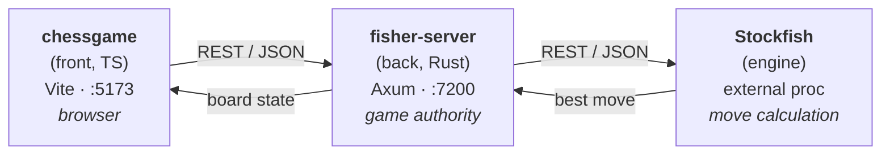

# Architecture

The **ChessGame** project lets a human play chess in the browser against a
Stockfish engine. It is split into three cooperating processes: a TypeScript
front end, a Rust back end, and the Stockfish engine.

> Naming note: the back end is called **fisher-server** — a pun on *Fischer*
> (the chess champion) and *fish* (Stock**fish**). It is the brain that talks to
> the engine on the front end's behalf.

---

## 1. Overview



| Layer | Module | Tech | Port | Responsibility |
| --- | --- | --- | --- | --- |
| Front | `chessgame` | TypeScript + Vite | `5173` | Render the board, capture user moves, call the back end |
| Back | `fisher-server` | Rust + Axum | `7200` | Hold game state, validate moves, broker the engine |
| Engine | Stockfish | REST (Docker image) | `4000` | Compute the best reply for a given position |

---

## 2. Components

### 2.1 `chessgame` — front end

A Vite-powered TypeScript single-page app served at **http://localhost:5173/**.

Responsibilities:

* Render the board and pieces, and reflect the global position served by the back end.
* Let the player interact: select a piece, drag/drop or click-to-move.
* Refresh the board on demand from the global position held by `fisher-server`.
* Show side panels: move list, captured pieces, whose turn it is.
* Talk to the `fisher-server` REST APIs (no direct contact with Stockfish).

Code layout (per [coding-rules.md](coding-rules.md)):

| Folder | Purpose |
| --- | --- |
| `infra` | Routines that call the REST APIs |
| `domain` | Local computation (board model, coordinate maths, move helpers) |
| `events` | Page event handling (clicks, drag/drop, keyboard) |
| `tests` | Unit tests for the front module |

### 2.2 `fisher-server` — back end

A Rust / Axum service exposing RESTful APIs at **http://localhost:7200/**.
It is the **single source of truth** for a game in progress.

Responsibilities:

* Keep the ordered list of moves played.
* Keep the global position of every piece on the board.
* Know the `uuid` of the current game.
* Keep the list of captured pieces.
* Communicate with the Stockfish engine to obtain the best next move.

Code layout (per [coding-rules.md](coding-rules.md)):

* Entry points live in `main`, but each delegates to a routine in a
  business-oriented subfolder (e.g. `game/`, `engine/`, `moves/`).
* Logging is mandatory: when a service starts/ends, when a meaningful action
  succeeds or fails, and when a process takes an important branch.

### 2.3 Stockfish — engine

We run Stockfish via the **`ghcr.io/samuraitruong/stockfish-docker:14.1`**
Docker image. Rather than raw UCI over stdio, this image wraps the engine in a
small **REST/HTTP** service. `fisher-server` calls it over HTTP with a FEN and
reads back the best move as JSON; the front end never talks to it directly.

To start the stockfish engine (host port `4000` → container `3000`):

```bash
docker run \
  --name stockfish \
  -p 4000:3000 \
  ghcr.io/samuraitruong/stockfish-docker:14.1 \
  stockfish
```

**REST contract**

* `GET /` — health check, returns `{"ready":true,"stockfish_version":"14.1"}`.
* `GET /bestmove?fen=<FEN>&depth=<N>` — best move for the given position.
  `depth` is optional. Which side moves is encoded in the FEN (` b ` = Black,
  ` w ` = White), so there is no separate colour parameter. The move comes back
  in UCI long-algebraic notation (e.g. `c7c5`).

Example — ask the engine to move Black after `1. e4`:

```bash
curl "http://localhost:4000/bestmove?fen=rnbqkbnr/pppppppp/8/8/4P3/8/PPPP1PPP/RNBQKBNR%20b%20KQkq%20e4%200%201&depth=15"
```

```json
{
  "result": { "bestmove": "c7c5", "ponder": "g1f3" },
  "fen": "rnbqkbnr/pppppppp/8/8/4P3/8/PPPP1PPP/RNBQKBNR b KQkq e4 0 1",
  "info": { "stockfish_version": "14.1" }
}
```

---

## 6. Runtime & development

| Service | URL | Start command |
| --- | --- | --- |
| Front | http://localhost:5173/ | `cd chessgame && npm run dev` |
| Back | http://localhost:7200/ | `cd fisher-server && cargo run` |
| Engine | http://localhost:4000/ | `docker run --name stockfish -p 4000:3000 ghcr.io/samuraitruong/stockfish-docker:14.1 stockfish` |

The front talks to the back across origins, so `fisher-server` must enable
**CORS** for `http://localhost:5173` during development.

---

## 7. Open questions & ideas

Things worth deciding early:

* **Engine transport.** Spawn Stockfish as a child process and speak UCI over
  stdio (simplest), or run it as a separate networked service? This drives the
  "undef port yet" note.
* **Move validation.** Where do chess rules live — in `fisher-server` (so the
  server is authoritative and the front stays thin), or shared? Recommended:
  validate authoritatively on the server.
* **State storage.** In-memory map of `uuid → game` is enough for a demo;
  add persistence (file/SQLite) only if games must survive a restart.
* **Engine difficulty.** Expose Stockfish skill level / think time as a game
  setting (`POST /games` parameter).
* **Real-time updates.** REST polling works for a turn-based game; consider
  Server-Sent Events or WebSocket later if you want spectators or live sync.
* **API contract first.** Pin the JSON shapes in §4–§5 so the front and the
  `api-tests` integration suite can be built in parallel.

---

## 8. Related documents

* [coding-rules.md](coding-rules.md) — folder conventions and logging rules.
