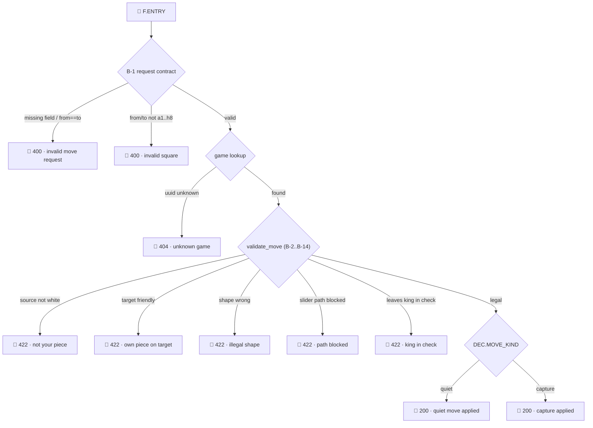

# Proof-line matching — classify by the *path*, not by the *context*

## The problem

[Proof logs](proof-logs.md) exist so that, when production misbehaves, we can
take the real execution — its **proof line**, the ordered run of logs for one
context — and match it against the **proven set** the integration tests produced,
then diff the two ("reinjection"). That only works if we can *find* the matching
proven proof line.

The obstacle is context. One feature's IT run emits **many proof-line blocs**,
one per scenario, and the context that distinguishes them — the board, the
`from`/`to` squares, the game `uuid`, the session — is effectively **infinite**.
We cannot enumerate every context, cannot hand-classify them, and cannot be sure
a production context will ever equal a test context we captured. Worse, many
different contexts clearly *should* be treated as one: `d2→d4` and `e2→e3` are
different inputs but the same move story. How do we group them, and how do we
match a production execution to the right group?

**Where we stand today.** A proof line's only stable key right now is the
`stream` tag — the feature name. `session` is a hardcoded placeholder (`"1234"`)
and the request/tracking id is a fresh random number per call
([`fisher-server/src/lib.rs`](../../fisher-server/src/lib.rs) `follower_ids`),
i.e. noise. **Nothing in the key encodes which path the code took.** That is the
real reason matching feels impossible — not that context is infinite, but that we
are keying on context at all. The good news: the log *messages* already carry the
right raw material — `mode=`, `reason=`, `move_kind=`, `capture=`, `legal=`,
`result=`. Those categorical fields are the seed of a real key.

## The reframe

The norm already states the answer in one line:

> *A proof line **is the execution path**.*

So stop classifying **context** and classify the **path**.

The map *context → path* is **many-to-one**: infinitely many contexts drive the
code down the same path and emit the same log skeleton. The set of contexts that
share a path is that path's **family** (its equivalence class). And for the kind
of code we validate here — pure, deterministic, finitely-branching routines like
`validate_move`, `accessible_squares`, `is_in_check` — the number of **feasible
paths is finite and small**, a handful per feature.

**Infinite inputs, finite paths.** That asymmetry is the whole opening. We never
classify context directly. We turn each path into a canonical **signature**, and
"same family despite different values" stops being a problem to fight — it becomes
the design goal, achieved for free.

## Prior art

This is a well-trodden problem; the scheme borrows five mature ideas.

| Idea | Field | What we take |
| ---- | ----- | ------------ |
| **Equivalence partitioning** | test design | a "family" is an input-domain class the program treats identically |
| **Path conditions / symbolic execution** (King 1976; concolic testing, DART/KLEE) | verification | a family is *described* by a predicate over inputs, not enumerated member by member |
| **Log-template mining** (Drain, Spell) | observability | split each log into a constant skeleton and variable parameters — the exact "same family, different values" split |
| **Crash-signature bucketing** (Windows Error Reporting, Mozilla Socorro) | industry | normalise a trace into a signature, hash it, bucket by it; match a production crash by *recomputing its signature* — the closest industrial analog to our goal |
| **Spectrum-based fault localization** (Ochiai, Tarantula; Liblit's Cooperative Bug Isolation) | debugging | represent a run as a vector of decision outcomes and rank by similarity — for the near-miss case |

## The signature — the family key

Give every proof-log site a stable **step code**: a closed enum tied to the spec
rule, emitted as a `step=` field. This is the same discipline `LogFeature` and
`IllegalReason` already use, and the `B-*` rule IDs in the specs *are* the
alphabet. Line numbers and prose drift; step codes don't.

The signature of a proof line is then:

```
signature = hash( stream + [ (step_i, categorical_outcome_i) for i in emission order ] )
```

- **Kept** (low-cardinality, structural): the step code, and categorical fields
  like `mode`, `result`, `reason`, `move_kind`, `capture ∈ {none, some}`,
  `piece_type`, `legal`, the HTTP status class.
- **Masked** (high-cardinality, instance data): `uuid`, `session`,
  `request`/`tracking`, timestamp, the exact `from`/`to`, the exact board, the
  captured piece letter, `file:line`.

Two executions whose steps and categorical outcomes match, in order, produce the
**same signature → the same family**, whatever their boards and coordinates. That
is the whole answer to "context is infinite": canonicalise the path, and the
equivalence emerges.

## The abstraction ladder

The one real design choice is the *grain* of each kept field, and it is a genuine
trade-off:

- Keep `from`/`to` exact → every move is its own family. Infinite again. No
  matching.
- Keep only `reason` → distinct bugs collapse into one family. False matches.

So each field gets an **abstraction function**: `move_kind ∈ {push1, push2,
diag_capture, ray, jump, king_step}` instead of coordinates; `capture ∈ {none,
some}`; piece → its *type*, not its square.

Make the ladder **multi-resolution** — a coarse-to-fine lattice of signatures.
Matching climbs it: match at the finest resolution that has a proven counterpart,
back off to a coarser one on a miss (the coarsest is just the `stream`). **This is
"classify to maximize matching" made precise:** the classification *is* the
multi-resolution signature, and you descend the ladder until you land on a proven
family.

## Matching a production proof line

Two tiers, and a miss is never a dead end.

1. **Exact match** at the finest resolution → the proven proof line for that
   family; diff it against the production one (reinjection).
2. **On a miss, degrade gracefully:**
   - **Resolution back-off** — recompute the signature one rung coarser and
     retry. The lattice guarantees you eventually land on *some* proven family.
   - **Trace distance (near-miss)** — rank proven families by Levenshtein edit
     distance over the step sequence, or Jaccard/Ochiai over the `(step, outcome)`
     set. The **edit script itself localizes the divergence**: "production
     inserted a `B14.KING_IN_CHECK` step no proven line has" points straight at
     king-safety.

A finest-resolution miss is itself a **finding**, not a failure: *production took
a path no test ever proved* — frequently exactly where the bug lives. Report the
miss **and** the nearest proven family; both are signals.

## What matching can and cannot judge — Mode A vs Mode B

Matching a production line to the tree tells you **which** leaf it landed on. It
does **not**, by itself, tell you whether that was the **right** leaf. Those are
two different questions, and only one of them the tree answers alone. This is also
the precise sense in which the tree and the IT proof play **different roles**: the
tree is the *index* (the space of possible outcomes), and the IT proof is the
*oracle* (which outcome is correct for a given input). Keep them separate and two
failure modes fall out.

| | What production does | Caught by the tree alone? |
| --- | --- | --- |
| **Mode B — impossible path** | Emits a step sequence that matches **no leaf** — a transition the code should not be able to make | **Yes.** "No proven family matches" is an anomaly the tree flags on its own (the finest-resolution miss above). |
| **Mode A — wrong-but-valid leaf** | Lands on a **real leaf**, just the wrong one for its input | **No.** |

**Mode A, concretely.** Production plays `d2→d4` and the run comes back on leaf
`L6` — *illegal shape*, `422`. `L6` is a perfectly legitimate leaf: nothing about
the proof line is structurally wrong. The tree cannot tell you this is a bug,
because the tree only knows the *space* of possible outcomes, not which outcome is
*correct for this input*. To know `d2→d4` should have produced `L9`, you need an
**oracle of the expected family** — and that is exactly what the IT proof supplies
(the [proof-logs norm](proof-logs.md) calls it the *proven counterpart*, and
reinjection is the **diff** against it). Matching to the tree is step 1; diffing
against the proven line is step 2. The tree makes step 1 cheap; it does not
replace step 2.

**The precise statement.**

- Comparing a faulty production line to the tree is **enough to classify it**, and
  **enough to flag a structural anomaly** (Mode B) — on its own.
- It is **not enough to judge correctness** of a valid-but-wrong outcome
  (Mode A). That still needs the spec/IT oracle for what family the input *should*
  have produced — or, for a production input no IT covered, re-running the
  reference validator to compute the expected leaf.

**What this makes of the IT proof.** Its value **shifts** rather than
disappears. The 18 concrete IT proof lines are redundant *as a classification
lookup table* — the 10-leaf tree supersedes them for the "which family?" question.
But the ITs still do two things the tree cannot: they **build and prove the tree**
(the evidence that each leaf is reachable and what a correct run of it looks like —
the tree is their *distillation*, not their replacement), and they are the
**oracle you diff against** once the tree has matched a line to a leaf. Same
evidence, two distinct roles: the tree is the index, the ITs are the source of
truth behind it.

## Completeness — prove all *families*, not run N tests

Because the validators are pure and bounded, the complete set of feasible
signatures is **enumerable**: bounded path enumeration / symbolic execution of
`validate_move`, or property-based testing (Rust `proptest`) instrumented to
record which signatures fire, or coverage-guided fuzzing that maximises distinct
signatures. IT coverage stops being "18 hand-picked scenarios" and becomes
*families covered / families feasible*.

This is what bounds "we can't be sure prod matches a test": the code **cannot**
take a path outside its own feasible-path set, so if the family set is complete,
every production signature exists in the base at some resolution. The only genuine
misses reduce to (a) a new code version and (b) nondeterminism or external state —
handled by versioning the base per code/spec revision.

## The base — storage

```
signature → { representative proof line, path-condition description, spec rule ids, code version }
```

plus a `coarse → {fine}` index for back-off, and a few concrete witness contexts
per family for debugging. It is **content-addressed** (the signature is a hash),
so identical families across runs dedup automatically — which is precisely what
collapses "several log blocs per feature" into one entry per family.

## Worked example — the proof-line tree of `MOVE-A-PIECE`

**For a feature, the tree of all feasible proof lines *is* the complete family
set.** Every root-to-leaf path is one proof line; every leaf is a `🏁` Feature
Exit. The tree is finite, and — the point — small. It is the artifact that turns
"infinite, unclassifiable context" into "a handful of families on one page."

It is not invented. It is read straight off the `log_*_f!` call sites in
[`fisher-server/src/lib.rs`](../../fisher-server/src/lib.rs) (the handler) and
[`fisher-server/src/moves/mod.rs`](../../fisher-server/src/moves/mod.rs) (the
validator and delegate). Each site gets a stable step code:

| Step code | Emitted at | Categorical field kept |
| --------- | ---------- | ---------------------- |
| `F.ENTRY` | lib.rs:200 | — (🚀) |
| `B1.BAD_REQUEST` | lib.rs:190 | `error="invalid move request"` |
| `B1.BAD_SQUARE` | lib.rs:190 | `error="invalid square"` |
| `B1.REQUEST_VALID` | lib.rs:219 | `request_valid=true` |
| `B1.UNKNOWN_GAME` | lib.rs:224 | `error="unknown game"` |
| `Bx.ILLEGAL` | moves.rs:357 + lib.rs:229 | `reason` (5-value enum) |
| `MOVE.LEGAL` | moves.rs:365 | `legal=true` |
| `DEC.MOVE_KIND` | moves.rs:369 | `move_kind ∈ {quiet, capture}` |
| `STATE.BOARD_UPDATED` | moves.rs:374 | — |
| `STATE.MOVE_RECORDED` | moves.rs:382 | `taken_count` (masked to 0 / >0) |
| `F.EXIT` | lib.rs:229 / :234 | `result ∈ {SUCCESS, FAILURE}` + status class |

The tree those steps induce:



**Ten leaves = ten families = the entire proof-line space of `MOVE-A-PIECE`.**
The two success leaves carry the long path
(`MOVE.LEGAL → DEC.MOVE_KIND → STATE.BOARD_UPDATED → STATE.MOVE_RECORDED →
F.EXIT`); the eight rejection leaves are short (entry → the deciding step → exit).
A leaf's signature is the ordered step list down to it, e.g.

```
L9 = [F.ENTRY, B1.REQUEST_VALID, MOVE.LEGAL, DEC.quiet,
      STATE.BOARD_UPDATED, STATE.MOVE_RECORDED, F.EXIT:200]
```

### The collapse — 18 scenarios fold onto 10 leaves

Mapping the [F0002 examples](../features/F0002-move-a-piece/F0002.md#examples) and
the [IT-F0002](../../api-tests/tests/integration_test_F0002.rs) scenarios onto the
tree:

| Leaf (family) | Contexts that land here — different values, one path |
| ------------- | ---------------------------------------------------- |
| `L9` quiet move | `d2→d4`, `e2→e3`, `g1→f3`, `e4→e5`, `e1→f1`, … |
| `L10` capture | `e4→d5` (`capture="p"`), … |
| `L4` not your piece | `e4→e5` (empty source), `d7→d5` (black source) |
| `L5` own piece on target | `g1→e2` |
| `L6` illegal shape | `d2→d5`, `e2→d3` |
| `L7` path blocked | `d1→d3`, `a1→a4` |
| `L8` king in check | `e2→d3` on the pin board |
| `L1` / `L2` / `L3` | `d2→d2`; `d2→d9`; unknown `uuid` |

The base holds **10 entries, not 18 blocs**. Content-addressing by signature
dedups the repeats. That is the resolution of "several log blocs for the same
feature": they were never distinct proof lines — only distinct *contexts* of the
same ten.

### What the tree buys us

- **Matching:** drop a production line into the tree by replaying its step codes;
  it lands on exactly one leaf. Different production values, same leaf — matched.
  No context catalogue needed.
- **Completeness:** the tree is the coverage target. The IT is complete iff every
  leaf is proven at least once. An unhit leaf is a missing test; a *production*
  line that reaches an unhit leaf is an unproven-path finding.
- **Near-miss:** a supposed quiet move that instead emits `B14.KING_IN_CHECK` sits
  at edit-distance 1 from `L9`, and the differing edge localizes the bug.

### An honest scaling note

`MOVE-A-PIECE` has 10 leaves because its *proof-log* decision points are coarse —
one `reason` per rejection. The sub-geometry inside `validate_move` (which piece,
which ray, pawn push vs double vs diagonal) is not separately logged, so it
collapses into `L6`/`L9`/`L10`. That is the abstraction ladder made concrete:
**the tree's resolution equals the granularity of the step codes you emit.** Want
finer families — split `L6` by piece type? Emit a `piece_type` step and that leaf
fans out. The tree grows or shrinks with the logging grain, which is exactly the
knob for trading match precision against family count.

## What to build next

The methodology above is derivable from today's logs with a small, mechanical set
of changes:

1. **Emit a stable `step=` field** (a closed enum, one variant per proof-log site)
   on every `log_*_f!` call. The `B-*` rule IDs already name them.
2. **Guarantee every meaningful branch emits a categorical outcome** field — most
   already do (`reason`, `move_kind`, `capture`, `legal`, `result`).
3. **Adopt a masking convention** so the signature builder is mechanical: prefix
   high-cardinality fields (`id.uuid`, `raw.from`, …) so they are dropped, and
   keep everything else.
4. **Build the signature index** — walk an IT run's logs, group by follower,
   canonicalise each proof line to a signature, and store the base as a
   content-addressed `signature → proof line` map (with the coarse→fine index).
5. **Build the matcher** — exact lookup, then resolution back-off, then
   trace-distance near-neighbour, reporting the "unproven path" case explicitly.

None of this changes the business contract; it only makes the proof lines
addressable.

---

*This document is a design reference, not a contract the tests pin. It defines
how proof lines are to be classified and matched; the [proof-logs norm](proof-logs.md)
remains the source of truth for what a proof log is and where it goes.*
